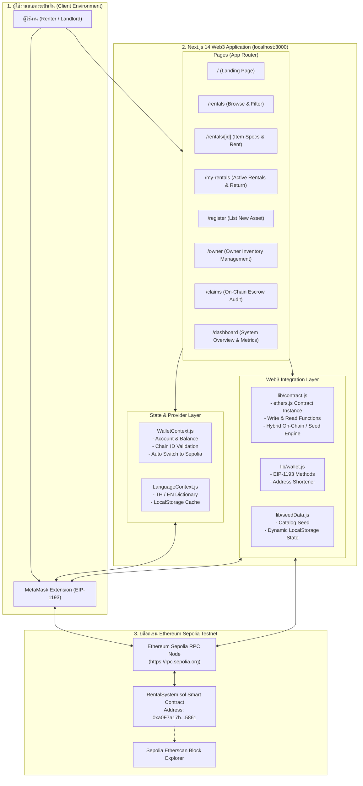
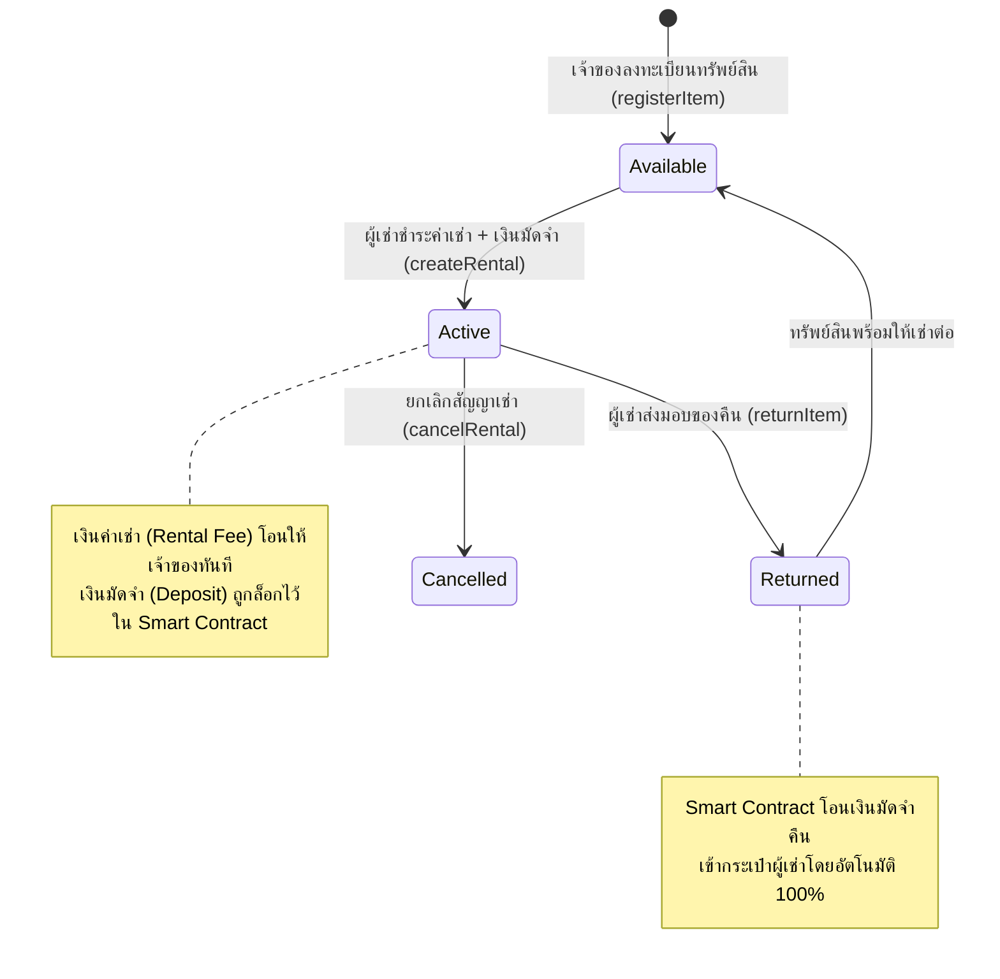

# 📦 Blockchain-Based Rental System (BlockRental)
> **ระบบจัดการการเช่าแบบกระจายศูนย์บนบล็อกเชน (Decentralized Web3 Rental Platform)**  
> พัฒนาด้วย **Next.js 14 (App Router)**, **JavaScript (ES6+)**, **ethers.js v6**, **Bootstrap 5.3**, **MetaMask** และเครือข่าย **Ethereum Sepolia Testnet**

[](https://sepolia.etherscan.io/)
[](#)
[](https://sepolia.etherscan.io/address/0xa0F7a17b2e403091F0397B3a8B9f99A8B65A5861)
[](https://nextjs.org/)
[](https://react.dev/)
[](https://docs.ethers.org/v6/)
[](https://getbootstrap.com/)
[](#)

---

## 📑 สารบัญ (Table of Contents)
1. [ภาพรวมโครงการและปัญหาที่แก้ไข (Project Overview & Problem Statement)](#1-ภาพรวมโครงการและปัญหาที่แก้ไข-project-overview)
2. [Tech Stack & Frameworks ทั้งหมดอย่างละเอียด (Technology Stack)](#2-tech-stack--frameworks-ทั้งหมดอย่างละเอียด-technology-stack)
3. [สถาปัตยกรรมและองค์ประกอบของระบบ (System Architecture & Data Flow)](#3-สถาปัตยกรรมและองค์ประกอบของระบบ-system-architecture--data-flow)
4. [โครงสร้างไดเรกทอรีและองค์ประกอบไฟล์ทั้งหมด (Directory & Component Structure)](#4-โครงสร้างไดเรกทอรีและองค์ประกอบไฟล์ทั้งหมด-directory-structure)
5. [สถาปัตยกรรมและรายละเอียด Smart Contract (Smart Contract Specifications)](#5-สถาปัตยกรรมและรายละเอียด-smart-contract-smart-contract-specifications)
6. [ฟีเจอร์หลักและการทำงานของระบบ (Core Features & Functionalities)](#6-ฟีเจอร์หลักและการทำงานของระบบ-core-features)
7. [ขั้นตอนการติดตั้งและเริ่มใช้งาน (Step-by-Step Installation & Setup Guide)](#7-ขั้นตอนการติดตั้งและเริ่มใช้งาน-setup-guide)
8. [คู่มือการทดสอบการใช้งานทีละสเต็ป (Step-by-Step Testing & User Guide)](#8-คู่มือการทดสอบการใช้งานทีละสเต็ป-testing-guide)
9. [ความปลอดภัยและการตรวจสอบสัญญา (Security, Best Practices & On-Chain Audit)](#9-ความปลอดภัยและการตรวจสอบสัญญา-security--best-practices)
10. [ข้อมูลสัญญาและผู้พัฒนา (Contract Info & Developer Credits)](#10-ข้อมูลสัญญาและผู้พัฒนา-credits)

---

## 1. ภาพรวมโครงการและปัญหาที่แก้ไข (Project Overview)

**Blockchain-Based Rental System (BlockRental)** คือแพลตฟอร์ม Web3 DApp สำหรับการบริหารจัดการการเช่าทรัพย์สินและอุปกรณ์แบบ Peer-to-Peer (P2P) ที่ทำงานบนบล็อกเชนแบบกระจายศูนย์ (Decentralized) 100% โดยเปลี่ยนจากการพึ่งพาตัวกลาง บุคคลที่สาม หรือกระดาษสัญญา มาเป็นการใช้ **Smart Contract** บนเครือข่ายบล็อกเชน Ethereum Sepolia ในการควบคุมสัญญา การล็อกเงินมัดจำ (Escrow) และการชำระเงินโดยอัตโนมัติ

### 🚨 ปัญหาของระบบการเช่าแบบดั้งเดิม (Traditional Rental Flaws)
* **ความเสี่ยงในการถูกยึดหรือเบี้ยวเงินมัดจำ (Deposit Withholding Disputes)**: เจ้าของทรัพย์สินหรือแพลตฟอร์มตัวกลางมักคืนเงินมัดจำล่าช้า หรือหักเงินมัดจำโดยไม่มีหลักฐานที่ตรวจสอบได้
* **การพึ่งพาตัวกลางและค่าธรรมเนียมสูง (Middleman Fees)**: แพลตฟอร์มตัวกลางหักค่าคอมมิชชั่นสูง (15% - 30%) จากทั้งผู้เช่าและผู้ให้เช่า
* **ข้อมูลสัญญาแก้ไขได้และขาดความโปร่งใส (Vulnerable Records)**: ข้อมูลในฐานข้อมูลรวมศูนย์ (Centralized Database) สามารถถูกแก้ไข เปลี่ยนแปลง หรือลบประวัติได้
* **ไม่มีระบบ Escrow ล็อกเงินที่ปลอดภัย**: การโอนเงินตรงผ่านบัญชีธนาคารทำให้ผู้เช่าเสี่ยงไม่ได้รับของ หรือผู้ให้เช่าเสี่ยงไม่ได้รับเงิน

### 💡 ทางออกด้วยเทคโนโลยีบล็อกเชน (Blockchain Solutions)
* **Smart Contract Escrow**: เงินมัดจำความเสียหาย (Security Deposit) จะถูกล็อกไว้ใน Bytecode ของสัญญาอัจฉริยะอย่างปลอดภัย และจะปลดล็อกโอนคืนให้ผู้เช่าทันทีเมื่อมีการกดยืนยันคืนของ (Return Item)
* **บันทึกถาวรแก้ไขไม่ได้ (Immutable Ledger)**: ทุกรายการเช่า รหัสทรัพย์สิน เวลาเริ่มต้น-สิ้นสุด และ Transaction Hash ถูกจัดเก็บอย่างถาวรบนบล็อกเชน
* **การระบุตัวตนด้วย Web3 Wallet**: เข้าสู่ระบบผ่านกระเป๋าเงินดิจิทัล **MetaMask** โดยไม่ต้องใช้ Username/Password ไม่มีการเก็บข้อมูลส่วนบุคคลบนเซิร์ฟเวอร์
* **ตรวจสอบความโปร่งใสได้ 100% (/claims)**: มีหน้าตรวจสอบสัญญาเช่าและเงินมัดจำสดจาก Smart Contract ป้องกันข้อพิพาท
* **รองรับ 2 ภาษาเต็มรูปแบบ (Bilingual TH / EN)**: มีระบบสลับภาษาไทยและอังกฤษ พร้อมระบบบันทึกความจำของผู้ใช้

---

## 2. Tech Stack & Frameworks ทั้งหมดอย่างละเอียด (Technology Stack)

| หมวดหมู่ (Category) | เทคโนโลยี / เครื่องมือ (Technology) | เวอร์ชัน (Version) | หน้าที่และความรับผิดชอบ (Role & Description) |
|---|---|---|---|
| **Core Framework** | [Next.js](https://nextjs.org/) (App Router) | `^14.2.15` | เฟรมเวิร์ก React หลักสำหรับการจัดการ App Router, Fast Refresh, Static & Dynamic Page Generation (ใช้ **JavaScript ES6+** ล้วน ไม่มี TypeScript เพื่อความเรียบง่ายและเสถียร) |
| **Frontend Library** | [React](https://react.dev/) / React DOM | `^18.3.1` | ไลบรารีหลักสำหรับสร้าง UI จัดการ State, Hooks, Context API, Effect และ Portal Rendering |
| **Web3 Client Engine** | [ethers.js](https://docs.ethers.org/v6/) | `^6.13.4` | ไลบรารีเชื่อมต่อ Ethereum บล็อกเชน จัดการ `BrowserProvider`, `JsonRpcProvider`, `Contract`, `parseEther`, `formatEther`, BigInt handling และ EIP-191 Signature |
| **Web3 Wallet Interface** | [MetaMask](https://metamask.io/) (EIP-1193) | Standard | กระเป๋าเงิน Web3 ดิจิทัล (Injected Provider `window.ethereum`) ใช้ยืนยันตัวตน, จัดการ Key Pairs, สลับ Network อัตโนมัติ และ Sign ธุรกรรม |
| **UI Framework** | [Bootstrap](https://getbootstrap.com/) | `^5.3.3` | CSS Framework จัดการ Responsive Grid System, Mobile Layout, Buttons, Modals, Cards, Badges และ Utilities |
| **Icons Library** | [Bootstrap Icons](https://icons.getbootstrap.com/) | `^1.11.3` | ไอคอนเวกเตอร์ SVG สำหรับการแสดงผลหน้าเว็บ, เมนูนำทาง, หมวดหมู่ และสถานะธุรกรรม |
| **Smart Contract** | [Solidity](https://soliditylang.org/) | `^0.8.20` | ภาษาสำหรับเขียนโปรแกรมสัญญาอัจฉริยะ คอมไพล์เป็น EVM Bytecode |
| **Security Standards** | [OpenZeppelin Contracts](https://www.openzeppelin.com/contracts) | `^5.0.0` | ไลบรารีความปลอดภัยมาตรฐานระดับสากล: `Ownable` (จัดการสิทธิ์เจ้าของ) และ `ReentrancyGuard` (ป้องกันการโจมตี Reentrancy Attack) |
| **Target Blockchain** | Ethereum Sepolia Testnet | Chain ID: `11155111` | บล็อกเชนทดสอบแบบ Proof-of-Stake ของ Ethereum สำหรับการทดสอบ Web3 DApp โดยใช้ Sepolia ETH ฟรี |
| **Development Tooling** | [Remix IDE](https://remix.ethereum.org/) | Web-based | เครื่องมือสำหรับเขียน ทดสอบ Unit Test, คอมไพล์ และ Deploy สัญญาอัจฉริยะขึ้น Sepolia |
| **Runtime Environment** | [Node.js](https://nodejs.org/) & npm | Node v18+ / v20+ / v22+ | สภาพแวดล้อมรัน JavaScript ฝั่งเครื่องเซิร์ฟเวอร์และเครื่องนักพัฒนา |

---

## 3. สถาปัตยกรรมและองค์ประกอบของระบบ (System Architecture & Data Flow)

### 🏗️ แผนภาพสถาปัตยกรรมรวม (System Architecture Diagram)



---

### 🔄 วงจรชีวิตของสัญญาเช่าและเงินมัดจำ (Rental & Escrow Lifecycle)



---

## 4. โครงสร้างไดเรกทอรีและองค์ประกอบไฟล์ทั้งหมด (Directory Structure)

```text
Blockchain-Rental-System-DApp/
├── .env.local                    # ค่าคอนฟิก Environment Variables (Local)
├── .env.local.example            # ตัวอย่างการตั้งค่า Environment Variables
├── .gitignore                    # ไฟล์ควบคุมการไม่นำไฟล์ระบบ/node_modules ขึ้น Git
├── package.json                  # การตั้งค่า Root Package
├── README.md                     # เอกสารโครงการฉบับสมบูรณ์ (ไฟล์นี้)
│
└── digital-rental/               # ซอร์สโค้ดโปรเจกต์ Next.js 14 DApp
    ├── abi/
    │   └── RentalSystem.json     # ABI (Application Binary Interface) ของสัญญาอัจฉริยะ
    │
    ├── app/                      # ไดเรกทอรีหน้าเว็บระบบ Next.js 14 App Router
    │   ├── claims/
    │   │   └── page.js           # หน้าตรวจสอบสัญญาและเงินมัดจำสดจากบล็อกเชน (/claims)
    │   ├── dashboard/
    │   │   └── page.js           # หน้าแดชบอร์ดภาพรวมระบบ กราฟ และ Ledger ประวัติธุรกรรม (/dashboard)
    │   ├── my-rentals/
    │   │   └── page.js           # หน้ารายการทรัพย์สินที่ฉันเช่า จัดการการคืนของ (/my-rentals)
    │   ├── owner/
    │   │   └── page.js           # แดชบอร์ดเจ้าของทรัพย์สิน สลับสถานะ เปิด/พัก ให้เช่า (/owner)
    │   ├── register/
    │   │   └── page.js           # หน้าลงทะเบียนทรัพย์สินใหม่ขึ้นบล็อกเชน (/register)
    │   ├── rentals/
    │   │   ├── [id]/
    │   │   │   └── page.js       # หน้ารายละเอียดทรัพย์สินรายชิ้น สเปก และการเช่า (/rentals/:id)
    │   │   └── page.js           # หน้าค้นหาและกรองทรัพย์สินให้เช่าทั้งหมด (/rentals)
    │   ├── globals.css           # สไตล์สากล, เอฟเฟกต์ Glassmorphism และ Web3 Animations
    │   ├── layout.js             # Root Layout ห่อหุ้ม WalletProvider และ LanguageProvider
    │   └── page.js               # Landing Page แนะนำแพลตฟอร์มและฟีเจอร์เด่น (/)
    │
    ├── components/               # คอมโพเนนต์ UI แบบ Reusable
    │   ├── ConnectWallet.js      # ปุ่มและ Modal จัดการกระเป๋าเงิน MetaMask (ใช้ React Portal)
    │   ├── ErrorMessage.js       # การแจ้งเตือนข้อผิดพลาดพร้อมปุ่มลองใหม่
    │   ├── Footer.js             # ส่วนท้ายหน้าเว็บ แสดงลิงก์และสถานะบล็อกเชน
    │   ├── ItemCard.js           # การ์ดแสดงรายการทรัพย์สินในหน้าแคตตาล็อก
    │   ├── Loading.js            # แอนิเมชัน Spinner แสดงระหว่างรอโหลดข้อมูลบล็อกเชน
    │   ├── Navbar.js             # แถบเมนูด้านบน สลับ 2 ภาษา และปุ่มเชื่อมต่อกระเป๋า
    │   ├── RentalCard.js         # การ์ดแสดงสัญญาเช่าในหน้าประวัติ
    │   ├── RentalModal.js        # หน้าต่างคำนวณราคาเช่าและกดยืนยันทำสัญญาเช่า
    │   ├── RentalStatus.js       # ป้าย Badge สีแสดงสถานะสัญญา (Active, Returned, Cancelled)
    │   └── TransactionStatus.js  # ป้ายแสดงสถานะธุรกรรมและลิงก์เปิดดูบน Sepolia Etherscan
    │
    ├── context/                  # React Contexts จัดการ Global State
    │   ├── LanguageContext.js    # ระบบจัดการ 2 ภาษา (ภาษาไทย 🇹🇭 / ภาษาอังกฤษ 🇬🇧)
    │   └── WalletContext.js      # ระบบตรวจจับกระเป๋า MetaMask, Network และ Balance
    │
    ├── lib/                      # ยูทิลิตี้และฟังก์ชันเชื่อมต่อบล็อกเชน
    │   ├── constants.js          # ค่าคงที่ระบบ (Chain ID, Network Name, Fallback RPC)
    │   ├── contract.js           # ฟังก์ชัน Read/Write สัญญาอัจฉริยะผ่าน ethers.js v6
    │   ├── seedData.js           # ข้อมูลแคตตาล็อกจำลองและ Dynamic LocalStorage
    │   ├── translations.js       # พจนานุกรมคำแปลภาษาไทยและภาษาอังกฤษ
    │   └── wallet.js             # ฟังก์ชันจัดการ EIP-1193, สลับเชน และจัดรูปแบบ Address
    │
    ├── next.config.js            # การตั้งค่า Next.js
    └── package.json              # รายการ Dependencies และ Scripts ของ Next.js
```

---

## 5. สถาปัตยกรรมและรายละเอียด Smart Contract (Smart Contract Specifications)

### 📌 ข้อมูลการ Deploy จริงบน Sepolia Testnet
* **ชื่อสัญญา (Contract Name)**: `RentalSystem`
* **เครือข่ายบล็อกเชน (Network)**: Ethereum Sepolia Testnet
* **Chain ID**: `11155111` (Hex: `0xaa36a7`)
* **Contract Address**: [`0xa0F7a17b2e403091F0397B3a8B9f99A8B65A5861`](https://sepolia.etherscan.io/address/0xa0F7a17b2e403091F0397B3a8B9f99A8B65A5861)
* **Compiler Version**: Solidity `^0.8.20`
* **Security Standards**: OpenZeppelin `Ownable`, `ReentrancyGuard`

### ⚙️ โครงสร้างข้อมูลและฟังก์ชันหลักของสัญญา (Contract Interface & Specifications)

Smart Contract ถูกออกแบบตามมาตรฐานความปลอดภัยระดับสากล มีโครงสร้างและอินเทอร์เฟซหลักดังนี้:

| ฟังก์ชัน (Function) | สิทธิ์การเรียก (Access Control) | หน้าที่และการทำงาน (Description) |
|---|---|---|
| `registerItem(name, desc, category, price, deposit)` | เจ้าของทรัพย์สิน (Owner) | บันทึกทรัพย์สินใหม่ขึ้นสู่บล็อกเชน กำหนดค่าเช่ารายวันและเงินมัดจำประกันความเสียหาย |
| `updateItemAvailability(itemId, available)` | เจ้าของทรัพย์สิน (Owner) | สลับสถานะเปิดให้เช่า หรือพักการให้เช่าทรัพย์สินชั่วคราว |
| `createRental(itemId, durationInDays)` | ผู้เช่า (Renter, Payable) | ชำระค่าเช่ารวมเงินมัดจำ Escrow โอนค่าเช่าให้เจ้าของ และล็อกมัดจำไว้ในสัญญา |
| `returnItem(rentalId)` | ผู้เช่า (Renter) | ยืนยันการคืนของ และกระตุ้นให้สัญญาโอนคืนเงินมัดจำ Escrow กลับสู่ผู้เช่าอัตโนมัติ 100% |
| `cancelRental(rentalId)` | คู่สัญญา (Owner / Renter) | ยกเลิกสัญญาเช่าและคืนเงินมัดจำในกรณีเกิดข้อขัดแย้ง |
| `getAllItems()` / `getAllRentals()` | สาธารณะ (View / Free) | ฟังก์ชันอ่านข้อมูลทรัพย์สินและสัญญาเช่าทั้งหมดในคำสั่งเดียวแบบ Batch |
| `getItemCount()` / `getRentalCount()` | สาธารณะ (View / Free) | อ่านจำนวนทรัพย์สินและสัญญาเช่าสะสมทั้งหมดบนบล็อกเชน |

> [!NOTE]
> การติดต่อและเรียกใช้ฟังก์ชัน Smart Contract ทั้งหมดผ่านหน้าเว็บ ถูกเชื่อมต่อด้วย ABI มาตรฐานที่ไฟล์ `abi/RentalSystem.json` โดยทำงานผ่าน `ethers.js v6` บนเครือข่าย Ethereum Sepolia

---

## 6. ฟีเจอร์หลักและการทำงานของระบบ (Core Features)

1. **การค้นหาและกรองทรัพย์สิน (Search & Filter):** ค้นหาตามชื่อ คำบรรยาย ที่อยู่เจ้าของ และกรองตามหมวดหมู่ หรือสถานะความพร้อมให้เช่า
2. **ระบบคิดราคาและ Escrow แบบเรียลไทม์ (Live Pricing & Escrow Calculator):** คำนวณค่าเช่าตามจำนวนวัน รวมกับเงินมัดจำความเสียหายอัตโนมัติ
3. **การคืนทรัพย์สินพร้อมรับมัดจำคืนทันที (Instant Deposit Refund):** ผู้เช่ากดปุ่ม "คืนทรัพย์สิน" เพื่อกระตุ้นให้ Smart Contract คืนเงินมัดจำกลับเข้ากระเป๋าทันทีโดยไม่มีการหักค่าใช้จ่ายแอบแฝง
4. **การลงทะเบียนทรัพย์สินใหม่ (Asset Registration):** เจ้าของสามารถเพิ่มรายการทรัพย์สินของตนเองขึ้นสู่บล็อกเชนได้โดยตรง โดยผู้ลงทะเบียนจะถูกบันทึกเป็น Owner อย่างถาวร
5. **การจัดการทรัพย์สินโดยเจ้าของ (Owner Asset Control):** สามารถเปิดหรือพักการให้เช่า (Available / Unavailable) ได้ผ่าน Smart Contract
6. **หน้าตรวจสอบความโปร่งใสของสัญญา (/claims):** ตรวจสอบรหัสสัญญาเช่า ดูยอดเงินมัดจำที่ถูกล็อกอยู่ เวลาเริ่ม-สิ้นสุด และที่อยู่กระเป๋าคู่สัญญาแบบ On-Chain 100%
7. **แดชบอร์ดสถิติระบบ (/dashboard):** แสดงสถิติจำนวนทรัพย์สินทั้งหมด จำนวนสัญญาที่เกิดขึ้น และประวัติธุรกรรมแบบเรียลไทม์
8. **ระบบตรวจจับข้อผิดพลาดอัจฉริยะ (Smart Error Handling):** แปลง Error Code ของบล็อกเชนให้เป็นข้อความภาษาไทยที่เข้าใจง่าย เช่น ยอดเงินไม่พอ หรือกระเป๋าไม่อยู่บน Sepolia

---

## 7. ขั้นตอนการติดตั้งและเริ่มใช้งาน (Setup Guide)

### 📌 สิ่งที่ต้องเตรียม (Prerequisites)
1. **Node.js**: เวอร์ชัน 18.x ขึ้นไป (แนะนำ Node 20 หรือ Node 22)
2. **Git**: สำหรับดึงโค้ดและจัดการเวอร์ชัน
3. **MetaMask Extension**: ติดตั้งบนเบราว์เซอร์
4. **Sepolia ETH**: ขอรับเหรียญทดสอบฟรีได้จาก [Google Sepolia Faucet](https://cloud.google.com/application/web3/faucet/ethereum/sepolia) หรือ [Alchemy Faucet](https://www.alchemy.com/faucets/ethereum-sepolia)

### 🚀 ขั้นตอนการติดตั้งและรัน
```bash
# 1. Clone repository
git clone https://github.com/Kitikon15/Blockchain-Rental-System-DApp.git
cd Blockchain-Rental-System-DApp/digital-rental

# 2. ติดตั้ง Dependencies
npm install

# 3. ตรวจสอบไฟล์ .env.local ว่ามีข้อมูลครบถ้วน:
# NEXT_PUBLIC_CONTRACT_ADDRESS=0xa0F7a17b2e403091F0397B3a8B9f99A8B65A5861
# NEXT_PUBLIC_CHAIN_ID=11155111
# NEXT_PUBLIC_NETWORK_NAME=Sepolia
# NEXT_PUBLIC_EXPLORER_URL=https://sepolia.etherscan.io
# NEXT_PUBLIC_RPC_URL=https://rpc.sepolia.org

# 4. สตาร์ต Development Server
npm run dev
```

เปิดเบราว์เซอร์แล้วเข้าไปที่: 👉 **[http://localhost:3000](http://localhost:3000)**

---

## 8. คู่มือการทดสอบการใช้งานทีละสเต็ป (Testing Guide)

### 🛒 สเต็ปที่ 1: การเช่าของ (Rent an Item)
1. เปิดหน้าเว็บ [http://localhost:3000/rentals](http://localhost:3000/rentals)
2. กดปุ่ม **"เชื่อมต่อกระเป๋า"** ด้านบน และสลับเครือข่ายเป็น **Sepolia**
3. เลือกทรัพย์สินที่ต้องการ (เช่น กีตาร์ **Item #7** หรือ กล้อง **Item #2**) แล้วกด **"เช่าทันที"**
4. ระบุจำนวนวันที่ต้องการเช่า (เช่น 1 วัน) แล้วกด **"ยืนยันและชำระเงิน"**
5. หน้าต่าง MetaMask จะเด้งขึ้นมา ให้กด **"ยืนยัน (Confirm)"**
6. เมื่อบล็อกเชนประมวลผลเสร็จ หน้าจอจะขึ้นข้อความสำเร็จพร้อมลิงก์ Tx Hash

### 📦 สเต็ปที่ 2: การคืนของและรับเงินมัดจำคืน (Return Item & Get Deposit)
1. ไปที่เมนู **"การเช่าของฉัน" ([/my-rentals](http://localhost:3000/my-rentals))**
2. รายการที่คุณเพิ่งเช่าจะแสดงสถานะ **กำลังเช่า (Active)**
3. คลิกปุ่ม **"คืนทรัพย์สิน"** แล้วกดยืนยันใน MetaMask
4. Smart Contract จะปลดล็อกเงินมัดจำโอนคืนเข้ากระเป๋าของคุณทันที และสถานะจะเปลี่ยนเป็น **คืนแล้ว (Returned)**

### 🔍 สเต็ปที่ 3: การตรวจสอบสัญญาเช่าบนบล็อกเชน (Audit on /claims)
1. ไปที่เมนู **"ตรวจสอบสัญญา" ([/claims](http://localhost:3000/claims))**
2. คลิกปุ่มตัวอย่าง เช่น **`[ #101 ]`** หรือ **`[ #102 ]`** หรือกรอกเลขรหัสสัญญาที่คุณเช่า
3. กดปุ่ม **"ตรวจสอบบนบล็อกเชน"** เพื่อดูข้อมูลสถานะเงินมัดจำและคู่สัญญาแบบสดจากบล็อกเชน

---

## 9. ความปลอดภัยและการตรวจสอบสัญญา (Security & Best Practices)

* **OpenZeppelin ReentrancyGuard**: ป้องกันการโจมตี Reentrancy ในทุกฟังก์ชันที่มีการโอนเงิน ETH ด้วย Modifier `nonReentrant`
* **Checks-Effects-Interactions**: ตรวจสอบเงื่อนไข (`require`) และเปลี่ยนแปลงสถานะสัญญาก่อนการส่งโอน ETH เสมอ
* **Owner Self-Rental Prevention**: สัญญามีคำสั่ง `require(item.owner != msg.sender)` ป้องกันเจ้าของจ่ายเงินเช่าของตัวเอง
* **Strict Non-Zero Handling**: ป้องกันการดึงค่า struct ที่ยังไม่ถูกกำหนดค่าใน Solidity mapping บน EVM
* **EIP-1193 Listeners**: มีระบบตรวจจับการสลับบัญชี (`accountsChanged`) และสลับเชน (`chainChanged`) ใน MetaMask โดยอัตโนมัติ

---

## 10. ข้อมูลสัญญาและผู้พัฒนา (Credits)

* **ชื่อโปรเจกต์**: Blockchain-Based Rental System (BlockRental)
* **ประเภท**: Decentralized Web3 Application (DApp)
* **GitHub Repository**: [https://github.com/Kitikon15/Blockchain-Rental-System-DApp](https://github.com/Kitikon15/Blockchain-Rental-System-DApp)
