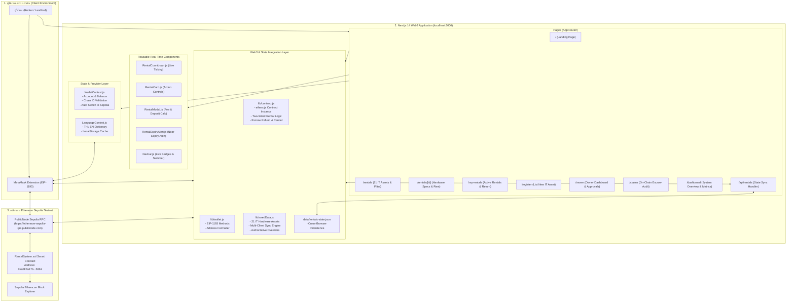
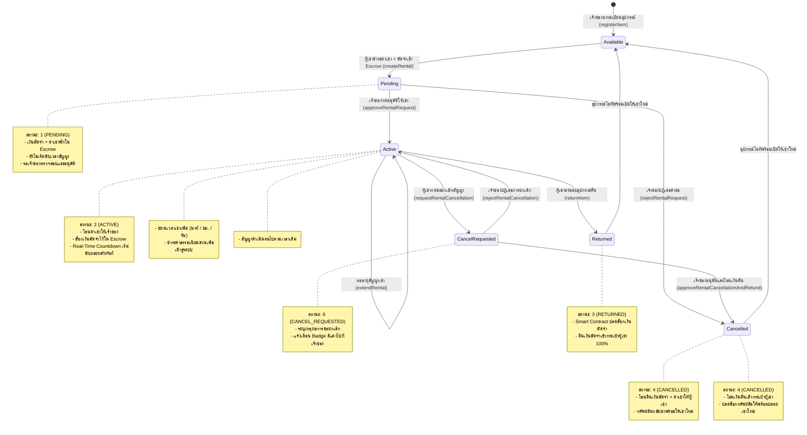

# 📦 Blockchain-Based Rental System (BlockRental)
> **ระบบจัดการการเช่าอุปกรณ์ไอทีและฮาร์ดแวร์แบบกระจายศูนย์บนบล็อกเชน (Decentralized Web3 IT Rental Platform)**  
> พัฒนาด้วย **Next.js 14 (App Router)**, **JavaScript (ES6+)**, **ethers.js v6**, **Bootstrap 5.3**, **MetaMask** และเครือข่าย **Ethereum Sepolia Testnet**

[](https://sepolia.etherscan.io/)
[](#)
[](https://sepolia.etherscan.io/address/0xa0F7a17b2e403091F0397B3a8B9f99A8B65A5861)
[](https://nextjs.org/)
[](https://react.dev/)
[](https://docs.ethers.org/v6/)
[](https://getbootstrap.com/)
[](#)

---

## 📑 สารบัญ (Table of Contents)
1. [ภาพรวมโครงการและปัญหาที่แก้ไข (Project Overview & Problem Statement)](#1-ภาพรวมโครงการและปัญหาที่แก้ไข-project-overview)
2. [Tech Stack & Frameworks ทั้งหมดอย่างละเอียด (Technology Stack)](#2-tech-stack--frameworks-ทั้งหมดอย่างละเอียด-technology-stack)
3. [สถาปัตยกรรมและองค์ประกอบของระบบ (System Architecture & Data Flow)](#3-สถาปัตยกรรมและองค์ประกอบของระบบ-system-architecture--data-flow)
4. [วงจรชีวิตของสัญญาเช่าและระบบ Escrow 2 ฝ่าย (Rental & Escrow Lifecycle)](#4-วงจรชีวิตของสัญญาเช่าและระบบ-escrow-2-ฝ่าย-rental--escrow-lifecycle)
5. [โครงสร้างไดเรกทอรีและองค์ประกอบไฟล์ทั้งหมด (Directory Structure)](#5-โครงสร้างไดเรกทอรีและองค์ประกอบไฟล์ทั้งหมด-directory-structure)
6. [สถาปัตยกรรมและรายละเอียด Smart Contract (Smart Contract Specifications)](#6-สถาปัตยกรรมและรายละเอียด-smart-contract-smart-contract-specifications)
7. [ฟีเจอร์หลักและการทำงานแบบ Real-Time (Core Features & Real-Time Capabilities)](#7-ฟีเจอร์หลักและการทำงานแบบ-real-time-core-features)
8. [ขั้นตอนการติดตั้งและเริ่มใช้งาน (Step-by-Step Installation & Setup Guide)](#9-ขั้นตอนการติดตั้งและเริ่มใช้งาน-setup-guide)
9. [คู่มือการทดสอบการใช้งานทีละสเต็ป (Step-by-Step Testing & User Guide)](#10-คู่มือการทดสอบการใช้งานทีละสเต็ป-testing-guide)
10. [ความปลอดภัยและการตรวจสอบสัญญา (Security, Best Practices & On-Chain Audit)](#11-ความปลอดภัยและการตรวจสอบสัญญา-security--best-practices)
11. [ข้อมูลสัญญาและผู้พัฒนา (Contract Info & Developer Credits)](#12-ข้อมูลสัญญาและผู้พัฒนา-credits)

---

## 1. ภาพรวมโครงการและปัญหาที่แก้ไข (Project Overview)

**Blockchain-Based Rental System (BlockRental)** คือแพลตฟอร์ม Web3 DApp สำหรับการบริหารจัดการการเช่าอุปกรณ์ไอที ฮาร์ดแวร์คอมพิวเตอร์ และอุปกรณ์เทคโนโลยีระดับสูงแบบ Peer-to-Peer (P2P) ที่ทำงานบนบล็อกเชนแบบกระจายศูนย์ (Decentralized) 100% โดยเปลี่ยนจากการพึ่งพาตัวกลาง บุคคลที่สาม หรือสัญญาบนกระดาษ มาเป็นการใช้ **Smart Contract** บนเครือข่ายบล็อกเชน Ethereum Sepolia ในการควบคุมสัญญา การล็อกเงินมัดจำ (Escrow) และการชำระเงินโดยอัตโนมัติ

### 🚨 ปัญหาของระบบการเช่าแบบดั้งเดิม (Traditional Rental Flaws)
* **ความเสี่ยงในการถูกยึดหรือเบี้ยวเงินมัดจำ (Deposit Disputes)**: เจ้าของทรัพย์สินหรือแพลตฟอร์มตัวกลางมักคืนเงินมัดจำล่าช้า หรือหักเงินมัดจำโดยไม่มีหลักฐานที่ตรวจสอบได้
* **การพึ่งพาตัวกลางและค่าคอมมิชชั่นสูง (Middleman Exploitation)**: แพลตฟอร์มตัวกลางหักค่าธรรมเนียม 15% - 30% จากทั้งผู้เช่าและผู้ให้เช่า
* **ข้อมูลสัญญาแก้ไขได้และขาดความโปร่งใส (Vulnerable Records)**: ข้อมูลในฐานข้อมูลรวมศูนย์ (Centralized DB) สามารถถูกแก้ไข เปลี่ยนแปลง หรือลบประวัติได้
* **ไม่มีระบบ Escrow ล็อกเงินที่โปร่งใส**: การโอนเงินตรงผ่านบัญชีธนาคารทำให้ผู้เช่าเสี่ยงไม่ได้รับของ หรือผู้ให้เช่าเสี่ยงไม่ได้รับเงิน

### 💡 ทางออกด้วยเทคโนโลยีบล็อกเชน (Blockchain Solutions)
* **Smart Contract Escrow อัตโนมัติ**: เงินมัดจำประกันความเสียหาย (Security Deposit) และค่าเช่าจะถูกล็อกไว้ใน Bytecode ของสัญญาอัจฉริยะอย่างปลอดภัย
* **ระบบการอนุมัติสัญญาเช่า 2 ฝ่าย (Two-Sided Agreement Flow)**: ผู้เช่าชำระเงินเข้า Escrow เพื่อขอเช่า (`PENDING`) และเจ้าของทรัพย์สินมีสิทธิ์กด **"อนุมัติให้เช่า"** เพื่อเริ่มสัญญาและเริ่มนับเวลาถอยหลัง หรือ **"ปฏิเสธ"** เพื่อคืนเงินให้ผู้เช่า
* **ระบบขอยกเลิกและคืนเงินที่ได้รับการยินยอมร่วมกัน (Mutual Cancellation & Refund)**: ผู้เช่าสามารถกด **"ขอยกเลิกสัญญา"** ได้ตลอดเวลา และเจ้าของมีหน้าต่างตรวจสอบยอดเงินคืนพร้อมกด **"อนุมัติ & คืนเงิน"** โอนเงินกลับสู่กระเป๋าผู้เช่าทันที
* **บันทึกถาวรแก้ไขไม่ได้ (Immutable Ledger)**: ทุกรายการเช่า รหัสทรัพย์สิน เวลาเริ่มต้น-สิ้นสุด และ Transaction Hash ถูกบันทึกถาวรบนบล็อกเชน
* **การระบุตัวตนด้วย Web3 Wallet**: เข้าใช้งานผ่านกระเป๋าเงินดิจิทัล **MetaMask** โดยตรง ไม่ต้องใช้ Username/Password ไม่มีการเก็บข้อมูลส่วนบุคคลบนเซิร์ฟเวอร์
* **หักเหรียญ ETH จริงบน Sepolia เริ่มต้น 0.05 ETH**: ทุกการทำธุรกรรมมีการตัดเหรียญ Sepolia ETH จริงเข้าสู่ระบบ
* **ระบบนับถอยหลัง Real-Time Countdown**: แสดงเวลานับถอยหลังสัญญาเช่าแบบวินาทีสด และอัปเดตสถานะทันทีเมื่อหมดเวลา พร้อมแจ้งเตือนเมื่อใกล้หมดอายุ
* **การต่ออายุสัญญาเช่า (Extend Rental)**: ขยายระยะเวลาเช่าเป็น นาที / ชั่วโมง / วัน ได้ทุกเมื่อพร้อมคำนวณค่าธรรมเนียมส่วนเพิ่มอัตโนมัติ
* **ตรวจสอบสัญญาและข้อพิพาทสด 100% (/claims)**: หน้า Audit ที่ให้เลือกดูสัญญาผ่าน Dropdown และ Quick Cards พร้อม Auto-Sync ดึงข้อมูลบล็อกเชนทุก 6 วินาที
* **ระบบซิงก์สถานะ Real-Time ข้ามเบราว์เซอร์ (`/api/rentals`)**: ซิงก์สถานะสัญญา คำขอเช่า และคำขอยกเลิกระหว่างหลายบัญชี/หลายเบราว์เซอร์อัตโนมัติ
* **รองรับ 2 ภาษาเต็มรูปแบบ (Bilingual TH / EN)**: มีระบบสลับภาษาไทยและอังกฤษ พร้อมระบบจดจำภาษาของผู้ใช้

---

## 2. Tech Stack & Frameworks ทั้งหมดอย่างละเอียด (Technology Stack)

| หมวดหมู่ (Category) | เทคโนโลยี / เครื่องมือ (Technology) | เวอร์ชัน (Version) | หน้าที่และความรับผิดชอบ (Role & Description) |
|---|---|---|---|
| **Core Framework** | [Next.js](https://nextjs.org/) (App Router) | `^14.2.15` | เฟรมเวิร์ก React หลักสำหรับการจัดการ App Router, Fast Refresh, Static & Dynamic Page Generation (ใช้ **JavaScript ES6+** ล้วน เพื่อความเรียบง่ายและเสถียร) |
| **Frontend Library** | [React](https://react.dev/) / React DOM | `^18.3.1` | ไลบรารีหลักสำหรับสร้าง UI จัดการ State, Hooks, Context API, Effect และ Portal Rendering |
| **Web3 Client Engine** | [ethers.js](https://docs.ethers.org/v6/) | `^6.13.4` | ไลบรารีเชื่อมต่อ Ethereum บล็อกเชน จัดการ `BrowserProvider`, `JsonRpcProvider`, `Contract`, `parseEther`, `formatEther`, BigInt handling และ EIP-191 Signatures |
| **Web3 Wallet Interface** | [MetaMask](https://metamask.io/) (EIP-1193) | Standard | กระเป๋าเงิน Web3 ดิจิทัล (Injected Provider `window.ethereum`) ใช้ยืนยันตัวตน, จัดการ Key Pairs, สลับ Network อัตโนมัติ และ Sign ธุรกรรม |
| **UI Framework** | [Bootstrap](https://getbootstrap.com/) | `^5.3.3` | CSS Framework จัดการ Responsive Grid System, Mobile Layout, Buttons, Modals, Cards, Badges และ Utilities |
| **Icons Library** | [Bootstrap Icons](https://icons.getbootstrap.com/) | `^1.11.3` | ไอคอนเวกเตอร์ SVG สำหรับการแสดงผลหน้าเว็บ, เมนูนำทาง, หมวดหมู่ และสถานะธุรกรรม |
| **Backend State Sync API** | Next.js Route Handlers (`/api/rentals`) | Next.js 14 | API สำหรับจัดเก็บและประสานสถานะสัญญาข้ามเครื่อง/ข้ามบัญชี (Authoritative State Synchronization) |
| **Smart Contract** | [Solidity](https://soliditylang.org/) | `^0.8.20` | ภาษาสำหรับเขียนโปรแกรมสัญญาอัจฉริยะ คอมไพล์เป็น EVM Bytecode |
| **Security Standards** | [OpenZeppelin Contracts](https://www.openzeppelin.com/contracts) | `^5.0.0` | ไลบรารีความปลอดภัยมาตรฐานระดับสากล: `Ownable` (จัดการสิทธิ์เจ้าของ) และ `ReentrancyGuard` (ป้องกันการโจมตี Reentrancy Attack) |
| **Target Blockchain** | Ethereum Sepolia Testnet | Chain ID: `11155111` | บล็อกเชนทดสอบแบบ Proof-of-Stake ของ Ethereum สำหรับการทดสอบ Web3 DApp โดยใช้ Sepolia ETH ฟรี |
| **Public RPC Provider** | Ethereum Sepolia PublicNode RPC | HTTPS | `https://ethereum-sepolia-rpc.publicnode.com` โหนด RPC ประสิทธิภาพสูงสำหรับการอ่านข้อมูล On-Chain |
| **Development Tooling** | [Remix IDE](https://remix.ethereum.org/) | Web-based | เครื่องมือสำหรับเขียน ทดสอบ Unit Test, คอมไพล์ และ Deploy สัญญาอัจฉริยะขึ้น Sepolia |
| **Runtime Environment** | [Node.js](https://nodejs.org/) & npm | Node v18+ / v20+ / v22+ | สภาพแวดล้อมรัน JavaScript ฝั่งเครื่องเซิร์ฟเวอร์และเครื่องนักพัฒนา |

---

## 3. สถาปัตยกรรมและองค์ประกอบของระบบ (System Architecture & Data Flow)

### 🏗️ แผนภาพสถาปัตยกรรมรวม (System Architecture Diagram)



---

## 4. วงจรชีวิตของสัญญาเช่าและระบบ Escrow 2 ฝ่าย (Rental & Escrow Lifecycle)



---

## 5. โครงสร้างไดเรกทอรีและองค์ประกอบไฟล์ทั้งหมด (Directory Structure)

```text
Blockchain-Rental-System-DApp/
├── .env.local.example            # ตัวอย่างการตั้งค่า Environment Variables
├── .gitignore                    # ไฟล์ควบคุมการไม่นำไฟล์ระบบ/node_modules ขึ้น Git
├── package.json                  # การตั้งค่า Root Package
├── README.md                     # เอกสารโครงการฉบับสมบูรณ์ (ไฟล์นี้)
│
└── digital-rental/               # ซอร์สโค้ดโปรเจกต์ Next.js 14 DApp
    ├── abi/
    │   └── RentalSystem.json     # ABI (Application Binary Interface) ของสัญญาอัจฉริยะ
    │
    ├── app/                      # ไดเรกทอรีหน้าเว็บระบบ Next.js 14 App Router
    │   ├── api/
    │   │   └── rentals/
    │   │       └── route.js      # REST API สำหรับ Sync สถานะสัญญาข้ามเครื่อง/ข้ามบัญชีแบบ Real-Time
    │   ├── claims/
    │   │   └── page.js           # หน้าตรวจสอบสัญญาและเงินมัดจำสดจากบล็อกเชนแบบ Real-Time (/claims)
    │   ├── dashboard/
    │   │   └── page.js           # หน้าแดชบอร์ดภาพรวมระบบ กราฟ และ Ledger ประวัติธุรกรรม (/dashboard)
    │   ├── my-rentals/
    │   │   └── page.js           # หน้ารายการทรัพย์สินที่ฉันเช่า กำลังเช่าสด และจัดการคืนของ (/my-rentals)
    │   ├── owner/
    │   │   └── page.js           # แดชบอร์ดเจ้าของ: อนุมัติคำขอเช่าใหม่, อนุมัติยกเลิก & คืนเงิน (/owner)
    │   ├── register/
    │   │   └── page.js           # หน้าลงทะเบียนอุปกรณ์ไอทีชิ้นใหม่ขึ้นบล็อกเชน (/register)
    │   ├── rentals/
    │   │   ├── [id]/
    │   │   │   └── page.js       # หน้ารายละเอียดทรัพย์สินรายชิ้น สเปก และการเช่า (/rentals/:id)
    │   │   └── page.js           # หน้าค้นหาและกรองอุปกรณ์ไอทีให้เช่าทั้ง 21 รายการ (/rentals)
    │   ├── globals.css           # สไตล์สากล, เอฟเฟกต์ Glassmorphism และ Web3 Animations
    │   ├── layout.js             # Root Layout ห่อหุ้ม WalletProvider, LanguageProvider และ Alert
    │   └── page.js               # Landing Page แนะนำแพลตฟอร์มและฟีเจอร์เด่น (/)
    │
    ├── components/               # คอมโพเนนต์ UI แบบ Reusable
    │   ├── ConnectWallet.js      # ปุ่มและ Modal จัดการกระเป๋าเงิน MetaMask (ใช้ React Portal)
    │   ├── ErrorMessage.js       # การแจ้งเตือนข้อผิดพลาดพร้อมปุ่มลองใหม่
    │   ├── Footer.js             # ส่วนท้ายหน้าเว็บ แสดงลิงก์และสถานะบล็อกเชน
    │   ├── ItemCard.js           # การ์ดแสดงรายการทรัพย์สินในหน้าแคตตาล็อก
    │   ├── Loading.js            # แอนิเมชัน Spinner แสดงระหว่างรอโหลดข้อมูลบล็อกเชน
    │   ├── Navbar.js             # แถบเมนูด้านบน สลับ 2 ภาษา และ Badge แจ้งเตือนคำขอสด
    │   ├── RentalCard.js         # การ์ดแสดงสัญญาเช่า พร้อมปุ่มต่ออายุ ส่งคืน และขอยกเลิกสัญญา
    │   ├── RentalCountdown.js    # คอมโพเนนต์นับเวลาถอยหลัง Real-Time Countdown Timer แบบวินาทีสด
    │   ├── RentalExpiryAlert.js  # แถบแจ้งเตือนลอยเมื่อสัญญาเช่าใกล้หมดอายุ (เหลือน้อยกว่า 10 นาที)
    │   ├── RentalModal.js        # หน้าต่างคำนวณราคาเช่า (นาที/ชั่วโมง/วัน) และกดยืนยันทำสัญญาเช่า
    │   ├── RentalStatus.js       # ป้าย Badge สีแสดงสถานะสัญญา (Pending, Active, Returned, Cancelled, ฯลฯ)
    │   └── TransactionStatus.js  # ป้ายแสดงสถานะธุรกรรมและลิงก์เปิดดูบน Sepolia Etherscan
    │
    ├── context/                  # React Contexts จัดการ Global State
    │   ├── LanguageContext.js    # ระบบจัดการ 2 ภาษา (ภาษาไทย 🇹🇭 / ภาษาอังกฤษ 🇬🇧)
    │   └── WalletContext.js      # ระบบตรวจจับกระเป๋า MetaMask, Network และ Balance
    │
    ├── data/
    │   └── rentals-state.json    # ฐานข้อมูล JSON สำหรับการซิงก์สถานะสัญญาแบบ Multi-Client
    │
    ├── lib/                      # ยูทิลิตี้และฟังก์ชันเชื่อมต่อบล็อกเชน
    │   ├── constants.js          # ค่าคงที่ระบบ (Chain ID, Network Name, Public RPC, RENTAL_STATUS)
    │   ├── contract.js           # ฟังก์ชัน Read/Write สัญญาอัจฉริยะผ่าน ethers.js v6
    │   ├── seedData.js           # ข้อมูลแคตตาล็อกอุปกรณ์ไอที 21 ชิ้น และ Multi-Client Sync Engine
    │   ├── translations.js       # พจนานุกรมคำแปลภาษาไทยและภาษาอังกฤษ
    │   └── wallet.js             # ฟังก์ชันจัดการ EIP-1193, สลับเชน และจัดรูปแบบ Address
    │
    ├── next.config.js            # การตั้งค่า Next.js
    └── package.json              # รายการ Dependencies และ Scripts ของ Next.js
```

---

## 6. สถาปัตยกรรมและรายละเอียด Smart Contract (Smart Contract Specifications)

### 📌 ข้อมูลการ Deploy จริงบน Sepolia Testnet
* **ชื่อสัญญา (Contract Name)**: `RentalSystem`
* **เครือข่ายบล็อกเชน (Network)**: Ethereum Sepolia Testnet
* **Chain ID**: `11155111` (Hex: `0xaa36a7`)
* **Contract Address**: [`0xa0F7a17b2e403091F0397B3a8B9f99A8B65A5861`](https://sepolia.etherscan.io/address/0xa0F7a17b2e403091F0397B3a8B9f99A8B65A5861)
* **Compiler Version**: Solidity `^0.8.20`
* **Security Standards**: OpenZeppelin `Ownable`, `ReentrancyGuard`

### ⚙️ โครงสร้างข้อมูลและฟังก์ชันหลักของสัญญา (Contract Interface & Specifications)

| ฟังก์ชัน (Function) | สิทธิ์การเรียก (Access Control) | หน้าที่และการทำงาน (Description) |
|---|---|---|
| `registerItem(name, desc, category, price, deposit)` | เจ้าของทรัพย์สิน (Owner) | บันทึกทรัพย์สินใหม่ขึ้นสู่บล็อกเชน กำหนดค่าเช่ารายวันและเงินมัดจำประกันความเสียหาย |
| `updateItemAvailability(itemId, available)` | เจ้าของทรัพย์สิน (Owner) | สลับสถานะเปิดให้เช่า หรือพักการให้เช่าทรัพย์สินชั่วคราว |
| `createRental(itemId, durationInDays)` | ผู้เช่า (Renter, Payable) | ชำระค่าเช่ารวมเงินมัดจำเข้าสู่ระบบ Escrow (เริ่มต้นสถานะ `PENDING`) |
| `returnItem(rentalId)` | ผู้เช่า (Renter) | ยืนยันการคืนของ และกระตุ้นให้สัญญาโอนคืนเงินมัดจำ Escrow กลับสู่ผู้เช่าอัตโนมัติ 100% |
| `cancelRental(rentalId)` | คู่สัญญา (Owner / Renter) | ยกเลิกสัญญาเช่าและคืนเงินมัดจำในกรณีเกิดข้อขัดแย้ง |
| `getAllItems()` / `getAllRentals()` | สาธารณะ (View / Free) | ฟังก์ชันอ่านข้อมูลทรัพย์สินและสัญญาเช่าทั้งหมดในคำสั่งเดียวแบบ Batch |
| `getItemCount()` / `getRentalCount()` | สาธารณะ (View / Free) | อ่านจำนวนทรัพย์สินและสัญญาเช่าสะสมทั้งหมดบนบล็อกเชน |

---

## 7. ฟีเจอร์หลักและการทำงานแบบ Real-Time (Core Features)

1. **ระบบการอนุมัติสัญญาเช่า 2 ฝ่าย (Two-Sided Rental Approval & Escrow):**
   - เมื่อผู้เช่าชำระเงินเช่า (Fee + Deposit) เข้าสู่ระบบ สถานะเริ่มต้นจะเป็น `PENDING: รอเจ้าของอนุมัติการเช่า` โดยเงินจะถูกพักไว้ใน Escrow อย่างปลอดภัย
   - สัญญาจะยังไม่เริ่มนับเวลาถอยหลัง จนกว่าเจ้าของทรัพย์สินจะกดปุ่ม **"อนุมัติให้เช่า (Approve Rental)"** ในแดชบอร์ดเจ้าของ (`/owner`)
   - หากเจ้าของกด **"ปฏิเสธ (Reject Rental Request)"** ระบบจะยกเลิกคำขอและคืนเงินมัดจำ+ค่าเช่าให้ผู้เช่าทันที
2. **ระบบการขอยกเลิกสัญญาและการคืนเงิน (Cancellation Request & Owner Refund Flow):**
   - ในสัญญาที่กำลังเช่าอยู่ (`ACTIVE`) ผู้เช่าสามารถกด **"ขอยกเลิกสัญญา"** พร้อมระบุเหตุผลได้ทันที
   - สถานะจะปรับเป็น `CANCEL_REQUESTED: รอเจ้าของอนุมัติยกเลิก & คืนเงิน`
   - เมื่อสลับเป็นบัญชีเจ้าของ:
     - Navbar จะแสดง **Badge สีแดงกะพริบ** แจ้งเตือนที่เมนูแดชบอร์ดเจ้าของ (`/owner`)
     - มี **Alert Banner สีแดงเด่นชัด** พร้อมส่วนเฉพาะ **"คำขอยกเลิกสัญญาเช่าที่รอคุณอนุมัติ & คืนเงิน"** ด้านบนสุดของหน้า `/owner`
     - เจ้าของสามารถเลือก **"อนุมัติ & คืนเงิน"** (เปิด Modal ปรับยอดเงินคืนและส่งธุรกรรมโอนเงินคืนผู้เช่าผ่าน MetaMask) หรือกด **"ปฏิเสธ"**
3. **ระบบซิงก์สถานะ Real-Time ข้ามเครื่องและข้ามบัญชี (`/api/rentals` & `rentals-state.json`):**
   - มี REST API และระบบ Polling อัตโนมัติทุก 6-8 วินาที
   - สถานะสัญญาจากเซิร์ฟเวอร์มีลำดับความสำคัญสูงสุด (Authoritative State Precedence) ทำให้ทุกเบราว์เซอร์และทุกบัญชีมองเห็นสถานะเดียวกันตรงกัน 100%
4. **การแสดงผลเฉพาะสัญญาของตัวเองในหน้า "การเช่าของฉัน" (`/my-rentals`):**
   - ผู้เช่าจะเห็นเฉพาะสัญญาเช่าที่กระเป๋าของตนเองเป็นผู้เช่า (`renter === account`) ป้องกันการมองเห็นสัญญาของผู้อื่น
5. **ระบบนับเวลาถอยหลัง Real-Time Countdown Timer (`RentalCountdown.js`):**
   - แสดงเวลาคงเหลือของสัญญาเช่าแบบเรียลไทม์เป็น วัน : ชั่วโมง : นาที : วินาที พร้อมแถบสถานะสีกะพริบสด (Live Badge)
   - ปรับสถานะเป็น "หมดเวลาเช่า" อัตโนมัติเมื่อสิ้นสุดสัญญา
6. **แถบแจ้งเตือนสัญญาใกล้หมดอายุ (`RentalExpiryAlert.js`):**
   - แจ้งเตือนแบบ Floating Alert ที่มุมขวาล่างเมื่อสัญญาเช่าเหลือเวลาน้อยกว่า 10 นาที หรือหมดเวลา เพื่อให้ผู้เช่าสามารถกดต่ออายุหรือส่งคืนของได้ทันท่วงที
7. **การต่ออายุสัญญาเช่า (Extend Rental Duration):**
   - ผู้เช่าสามารถกดปุ่ม **"ต่ออายุเช่า (Extend)"** เพื่อเพิ่มระยะเวลาสัญญาเช่าได้ทันที (นาที / ชั่วโมง / วัน) พร้อมคำนวณค่าธรรมเนียมส่วนเพิ่มตามสัดส่วนจริง
8. **หน้าตรวจสอบสัญญาเช่าและข้อพิพาทบนบล็อกเชนแบบ Real-Time (`/claims`):**
   - **Interactive Agreement Selector**: มีเมนูดรอปดาวน์และการ์ดคลิกเลือกสัญญาด่วนเพื่อตรวจสอบสัญญาที่ต้องการได้ในคลิกเดียว
   - **Live Auto-Sync**: ระบบดึงข้อมูลสดจากบล็อกเชนทุก 6 วินาที ตรวจสอบสถานะ Escrow, คู่สัญญา, และลิงก์ Etherscan แบบสด
9. **หักค่าเช่า Sepolia ETH จริง เริ่มต้น 0.05 ETH:**
   - ทุกรายการเช่ามีระบบชำระเงินจริงบนบล็อกเชน โดยกำหนดค่าเช่าและมัดจำเริ่มต้นที่ `0.0500 ETH`
10. **รองรับ 2 ภาษาเต็มรูปแบบ (Bilingual TH / EN):**
    - ระบบสลับภาษาไทยและอังกฤษ พร้อมระบบจดจำภาษาของผู้ใช้ใน LocalStorage

---


## 8. ขั้นตอนการติดตั้งและเริ่มใช้งาน (Setup Guide)

### 📌 สิ่งที่ต้องเตรียม (Prerequisites)
1. **Node.js**: เวอร์ชัน 18.x ขึ้นไป (แนะนำ Node 20 หรือ Node 22)
2. **Git**: สำหรับดึงโค้ดและจัดการเวอร์ชัน
3. **MetaMask Extension**: ติดตั้งบนเบราว์เซอร์
4. **Sepolia ETH**: ขอรับเหรียญทดสอบฟรีได้จาก [Google Cloud Sepolia Faucet](https://cloud.google.com/application/web3/faucet/ethereum/sepolia) หรือ [Alchemy Faucet](https://www.alchemy.com/faucets/ethereum-sepolia)

### 🚀 ขั้นตอนการติดตั้งและรัน
```bash
# 1. Clone repository
git clone https://github.com/Kitikon15/Blockchain-Rental-System-DApp.git
cd Blockchain-Rental-System-DApp/digital-rental

# 2. ติดตั้ง Dependencies
npm install

# 3. ตรวจสอบไฟล์ .env.local ว่ามีข้อมูลครบถ้วน:
# NEXT_PUBLIC_CONTRACT_ADDRESS=0xa0F7a17b2e403091F0397B3a8B9f99A8B65A5861
# NEXT_PUBLIC_CHAIN_ID=11155111
# NEXT_PUBLIC_NETWORK_NAME=Sepolia
# NEXT_PUBLIC_EXPLORER_URL=https://sepolia.etherscan.io
# NEXT_PUBLIC_RPC_URL=https://ethereum-sepolia-rpc.publicnode.com

# 4. สตาร์ต Development Server
npm run dev
```

เปิดเบราว์เซอร์แล้วเข้าไปที่: 👉 **[http://localhost:3000](http://localhost:3000)**

---

## 9. คู่มือการทดสอบการใช้งานทีละสเต็ป (Testing Guide)

### 🛒 สเต็ปที่ 1: การเช่าอุปกรณ์โดยผู้เช่า (Renter Request)
1. สลับกระเป๋า MetaMask ไปยังบัญชีผู้เช่า (เช่น Account B)
2. เปิดหน้าเว็บ [http://localhost:3000/rentals](http://localhost:3000/rentals)
3. เลือกอุปกรณ์ไอทีที่ต้องการเช่า (เช่น **Samsung Odyssey Ark #5** หรือ **NVIDIA RTX 4090 #9**) แล้วกด **"เช่าทันที"**
4. เลือกระยะเวลาเช่า (นาที, ชั่วโมง, หรือวัน) แล้วกดยืนยันชำระเงินผ่าน MetaMask
5. สัญญาจะถูกสร้างขึ้นในสถานะ **`รอเจ้าของอนุมัติการเช่า (Pending Owner Approval)`** โดยเงินมัดจำและค่าเช่าจะถูกล็อกไว้ในระบบ Escrow อย่างปลอดภัย

### 🛡️ สเต็ปที่ 2: เจ้าของตรวจสอบและอนุมัติสัญญาเช่า (Owner Approval)
1. สลับกระเป๋า MetaMask ไปยังบัญชีของเจ้าของทรัพย์สิน (Account A)
2. ไปที่หน้า **"แดชบอร์ดเจ้าของ" ([/owner](http://localhost:3000/owner))**
3. ด้านบนสุดของหน้าจะพบแถบแจ้งเตือนและกล่อง **"คำขอเช่าใหม่ที่รอคุณอนุมัติ"** พร้อมรายละเอียดสัญญาและยอดเงินที่ผู้เช่าชำระไว้
4. กดปุ่ม **`[✔ อนุมัติให้เช่า]`** และกดยืนยันผ่าน MetaMask
5. สถานะของสัญญาจะเปลี่ยนเป็น **`กำลังเช่าอยู่ (Active)`** ทันที และเวลาสัญญาจะเริ่มนับถอยหลังสด

### ⏱️ สเต็ปที่ 3: ผู้เช่าตรวจสอบสัญญา Real-Time ในหน้า "การเช่าของฉัน" (/my-rentals)
1. สลับกลับมาที่บัญชีกระเป๋าผู้เช่า (Account B) และไปที่เมนู **"การเช่าของฉัน" ([/my-rentals](http://localhost:3000/my-rentals))**
2. ระบบจะแสดงเฉพาะรายการเช่าของบัญชีคุณอย่างแม่นยำ พร้อมตัวเลขนับถอยหลัง Real-Time Countdown แบบวินาทีสด
3. มีปุ่มคำสั่งควบคุมครบถ้วน:
   - **`สเปก`**: ดูรายละเอียดฮาร์ดแวร์
   - **`ตรวจสัญญา`**: ลิงก์ตรงไปยังหน้า `/claims` เพื่อ Audit สัญญา
   - **`ต่ออายุเช่า`**: ขยายเวลาเช่าเพิ่ม
   - **`ขอยกเลิกสัญญา`**: ส่งคำขอยกเลิกไปยังเจ้าของทรัพย์สิน

### 🔄 สเต็ปที่ 4: การต่ออายุสัญญาเช่า (Extend Rental)
1. ในหน้า `/my-rentals` คลิกปุ่ม **"ต่ออายุเช่า (Extend)"** บนการ์ดสัญญา
2. ระบุระยะเวลาที่ต้องการขยาย (เช่น 2 นาที หรือ 1 วัน)
3. ระบบจะคำนวณค่าธรรมเนียมส่วนเพิ่มตามสัดส่วนจริง
4. กดยืนยันธุรกรรมใน MetaMask เมื่อทำรายการเสร็จ เวลาสิ้นสุดจะถูกขยายออกไปทันทีแบบ Real-Time

### ⚠️ สเต็ปที่ 5: การส่งคำขอยกเลิกสัญญาเช่า (Request Cancellation)
1. ในกรณีที่ต้องการยกเลิกสัญญา ให้คลิกปุ่ม **"ขอยกเลิกสัญญา"** บนการ์ดสัญญาในหน้า `/my-rentals`
2. ระบุเหตุผลในการขอยกเลิก และกดยืนยัน
3. สถานะสัญญาจะเปลี่ยนเป็น **`รอเจ้าของอนุมัติยกเลิก & คืนเงิน (Cancel Requested)`**

### 💸 สเต็ปที่ 6: เจ้าของอนุมัติการยกเลิกและโอนเงินคืน (Approve Cancellation & Refund)
1. สลับไปยังกระเป๋าเจ้าของทรัพย์สิน (Account A)
2. สังเกตที่ Navbar จะมี **Badge สีแดงกะพริบ** แจ้งเตือนที่เมนูแดชบอร์ดเจ้าของ (`/owner`)
3. ในหน้า `/owner` ด้านบนสุด จะมีแบนเนอร์สีแดงและกล่อง **"คำขอยกเลิกสัญญาเช่าที่รอคุณอนุมัติ & คืนเงิน"**
4. คลิกปุ่ม **`[✔ อนุมัติ & คืนเงิน]`** เพื่อเปิดหน้าต่างยืนยันยอดเงินคืน ETH (ค่าเริ่มต้นคือยอดที่ผู้เช่าชำระไว้ทั้งหมด)
5. กดยืนยันเพื่อโอนเงินคืนผู้เช่าผ่าน MetaMask
6. สัญญาจะเปลี่ยนสถานะเป็น **`ยกเลิกแล้ว (Cancelled)`** เงินถูกโอนคืนผู้เช่า และอุปกรณ์ไอทีจะปลดล็อกกลับมาพร้อมให้เช่าใหม่ทันที

### 🔍 สเต็ปที่ 7: การตรวจสอบสัญญาและข้อพิพาทบนบล็อกเชนสด (/claims)
1. ไปที่หน้า **"ตรวจสอบสัญญา" ([/claims](http://localhost:3000/claims))**
2. เลือกสัญญาที่ต้องการตรวจสอบจากเมนูดรอปดาวน์ **"เลือกสัญญาเพื่อตรวจสอบ"** หรือคลิกที่ Quick Agreement Card เช่น **`[ #5 ]`**
3. ระบบจะแสดงข้อมูลสถานะ On-Chain, ที่อยู่ผู้เช่าและผู้ให้เช่า, วันเวลาเริ่มต้น-สิ้นสุด, จำนวนเงินใน Escrow, และสถานะข้อพิพาทแบบ Real-Time พร้อม Auto-Sync ทุก 6 วินาที

---

## 10. ความปลอดภัยและการตรวจสอบสัญญา (Security & Best Practices)

* **OpenZeppelin ReentrancyGuard**: ป้องกันการโจมตี Reentrancy ในทุกฟังก์ชันที่มีการโอนเงิน ETH ด้วย Modifier `nonReentrant`
* **Checks-Effects-Interactions**: ตรวจสอบเงื่อนไข (`require`) และเปลี่ยนแปลงสถานะสัญญาก่อนการส่งโอน ETH เสมอ
* **Owner Self-Rental Prevention**: สัญญามีคำสั่ง `require(item.owner != msg.sender)` ป้องกันเจ้าของจ่ายเงินเช่าของตัวเอง
* **Strict Non-Zero Handling**: ป้องกันการดึงค่า struct ที่ยังไม่ถูกกำหนดค่าใน Solidity mapping บน EVM
* **Authoritative Multi-Client Sync**: สถานะสัญญาเช่าจาก Server API มีลำดับความสำคัญสูงสุดในการ Overwrite Local Storage ป้องกันปัญหา Cache ชนกันระหว่างกระเป๋า
* **Clean String Serialization**: ป้องกันปัญหา BigInt Error ด้วยการแปลงข้อมูลคริปโตเป็น String อย่างปลอดภัย
* **EIP-1193 Listeners**: มีระบบตรวจจับการสลับบัญชี (`accountsChanged`) และสลับเชน (`chainChanged`) ใน MetaMask โดยอัตโนมัติ

---

## 11. ข้อมูลสัญญาและผู้พัฒนา (Credits)

* **ชื่อโปรเจกต์**: Blockchain-Based Rental System (BlockRental)
* **ประเภท**: Decentralized Web3 Application (DApp)
* **RPC Endpoint**: `https://ethereum-sepolia-rpc.publicnode.com`
