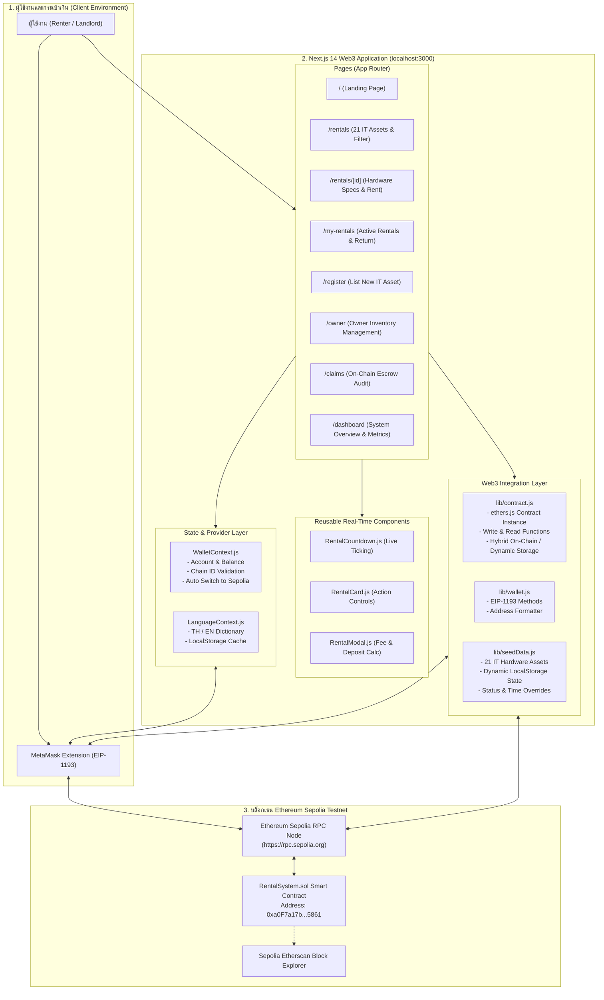
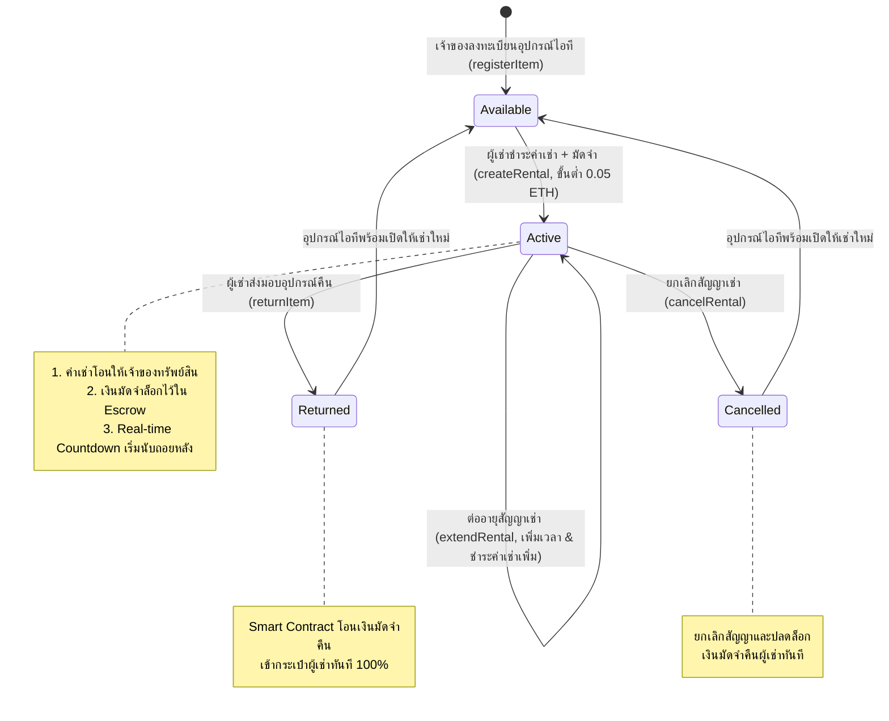

# 📦 Blockchain-Based Rental System (BlockRental)
> **ระบบจัดการการเช่าอุปกรณ์ไอทีและฮาร์ดแวร์แบบกระจายศูนย์บนบล็อกเชน (Decentralized Web3 IT Rental Platform)**  
> พัฒนาด้วย **Next.js 14 (App Router)**, **JavaScript (ES6+)**, **ethers.js v6**, **Bootstrap 5.3**, **MetaMask** และเครือข่าย **Ethereum Sepolia Testnet**

[](https://sepolia.etherscan.io/)
[](#)
[](https://sepolia.etherscan.io/address/0xa0F7a17b2e403091F0397B3a8B9f99A8B65A5861)
[](https://nextjs.org/)
[](https://react.dev/)
[](https://docs.ethers.org/v6/)
[](https://getbootstrap.com/)
[](#)

---

## 📑 สารบัญ (Table of Contents)
1. [ภาพรวมโครงการและปัญหาที่แก้ไข (Project Overview & Problem Statement)](#1-ภาพรวมโครงการและปัญหาที่แก้ไข-project-overview)
2. [Tech Stack & Frameworks ทั้งหมดอย่างละเอียด (Technology Stack)](#2-tech-stack--frameworks-ทั้งหมดอย่างละเอียด-technology-stack)
3. [สถาปัตยกรรมและองค์ประกอบของระบบ (System Architecture & Data Flow)](#3-สถาปัตยกรรมและองค์ประกอบของระบบ-system-architecture--data-flow)
4. [โครงสร้างไดเรกทอรีและองค์ประกอบไฟล์ทั้งหมด (Directory Structure)](#4-โครงสร้างไดเรกทอรีและองค์ประกอบไฟล์ทั้งหมด-directory-structure)
5. [สถาปัตยกรรมและรายละเอียด Smart Contract (Smart Contract Specifications)](#5-สถาปัตยกรรมและรายละเอียด-smart-contract-smart-contract-specifications)
6. [ฟีเจอร์หลักและการทำงานแบบ Real-Time (Core Features & Real-Time Capabilities)](#6-ฟีเจอร์หลักและการทำงานแบบ-real-time-core-features)
7. [แคตตาล็อกอุปกรณ์ไอทีและฮาร์ดแวร์ระดับมืออาชีพ 21 รายการ (IT Asset Catalog)](#7-แคตตาล็อกอุปกรณ์ไอทีและฮาร์ดแวร์ระดับมืออาชีพ-21-รายการ-it-asset-catalog)
8. [ขั้นตอนการติดตั้งและเริ่มใช้งาน (Step-by-Step Installation & Setup Guide)](#8-ขั้นตอนการติดตั้งและเริ่มใช้งาน-setup-guide)
9. [คู่มือการทดสอบการใช้งานทีละสเต็ป (Step-by-Step Testing & User Guide)](#9-คู่มือการทดสอบการใช้งานทีละสเต็ป-testing-guide)
10. [ความปลอดภัยและการตรวจสอบสัญญา (Security, Best Practices & On-Chain Audit)](#10-ความปลอดภัยและการตรวจสอบสัญญา-security--best-practices)
11. [ข้อมูลสัญญาและผู้พัฒนา (Contract Info & Developer Credits)](#11-ข้อมูลสัญญาและผู้พัฒนา-credits)

---

## 1. ภาพรวมโครงการและปัญหาที่แก้ไข (Project Overview)

**Blockchain-Based Rental System (BlockRental)** คือแพลตฟอร์ม Web3 DApp สำหรับการบริหารจัดการการเช่าอุปกรณ์ไอที ฮาร์ดแวร์คอมพิวเตอร์ และอุปกรณ์เทคโนโลยีระดับสูงแบบ Peer-to-Peer (P2P) ที่ทำงานบนบล็อกเชนแบบกระจายศูนย์ (Decentralized) 100% โดยเปลี่ยนจากการพึ่งพาตัวกลาง บุคคลที่สาม หรือสัญญาบนกระดาษ มาเป็นการใช้ **Smart Contract** บนเครือข่ายบล็อกเชน Ethereum Sepolia ในการควบคุมสัญญา การล็อกเงินมัดจำ (Escrow) และการชำระเงินโดยอัตโนมัติ

### 🚨 ปัญหาของระบบการเช่าแบบดั้งเดิม (Traditional Rental Flaws)
* **ความเสี่ยงในการถูกยึดหรือเบี้ยวเงินมัดจำ (Deposit Disputes)**: เจ้าของทรัพย์สินหรือแพลตฟอร์มตัวกลางมักคืนเงินมัดจำล่าช้า หรือหักเงินมัดจำโดยไม่มีหลักฐานที่ตรวจสอบได้
* **การพึ่งพาตัวกลางและค่าคอมมิชชั่นสูง (Middleman Exploitation)**: แพลตฟอร์มตัวกลางหักค่าธรรมเนียม 15% - 30% จากทั้งผู้เช่าและผู้ให้เช่า
* **ข้อมูลสัญญาแก้ไขได้และขาดความโปร่งใส (Vulnerable Records)**: ข้อมูลในฐานข้อมูลรวมศูนย์ (Centralized DB) สามารถถูกแก้ไข เปลี่ยนแปลง หรือลบประวัติได้
* **ไม่มีระบบ Escrow ล็อกเงินที่โปร่งใส**: การโอนเงินตรงผ่านบัญชีธนาคารทำให้ผู้เช่าเสี่ยงไม่ได้รับของ หรือผู้ให้เช่าเสี่ยงไม่ได้รับเงิน

### 💡 ทางออกด้วยเทคโนโลยีบล็อกเชน (Blockchain Solutions)
* **Smart Contract Escrow อัตโนมัติ**: เงินมัดจำประกันความเสียหาย (Security Deposit) จะถูกล็อกไว้ใน Bytecode ของสัญญาอัจฉริยะ และจะปลดล็อกโอนคืนให้ผู้เช่าทันทีเมื่อมีการกดยืนยันคืนของ (Return Item) หรือยกเลิกสัญญา (Cancel Rental)
* **บันทึกถาวรแก้ไขไม่ได้ (Immutable Ledger)**: ทุกรายการเช่า รหัสทรัพย์สิน เวลาเริ่มต้น-สิ้นสุด และ Transaction Hash ถูกบันทึกถาวรบนบล็อกเชน
* **การระบุตัวตนด้วย Web3 Wallet**: เข้าใช้งานผ่านกระเป๋าเงินดิจิทัล **MetaMask** โดยตรง ไม่ต้องใช้ Username/Password ไม่มีการเก็บข้อมูลส่วนบุคคลบนเซิร์ฟเวอร์
* **หักเหรียญ ETH จริงบน Sepolia เริ่มต้น 0.05 ETH**: ทุกการทำธุรกรรมมีการตัดเหรียญ Sepolia ETH จริงเข้าสู่ระบบ
* **ระบบนับถอยหลัง Real-Time Countdown**: แสดงเวลานับถอยหลังสัญญาเช่าแบบวินาทีสด และอัปเดตสถานะทันทีเมื่อหมดเวลา
* **การต่ออายุสัญญาเช่า (Extend Rental)**: ขยายระยะเวลาเช่าเป็น นาที / ชั่วโมง / วัน ได้ทุกเมื่อพร้อมคำนวณค่าธรรมเนียมส่วนเพิ่มอัตโนมัติ
* **ตรวจสอบสัญญาและข้อพิพาทสด 100% (/claims)**: หน้า Audit ที่ให้เลือกดูสัญญาผ่าน Dropdown และ Quick Cards พร้อม Auto-Sync ดึงข้อมูลบล็อกเชนทุก 6 วินาที
* **รองรับ 2 ภาษาเต็มรูปแบบ (Bilingual TH / EN)**: มีระบบสลับภาษาไทยและอังกฤษ พร้อมระบบจดจำภาษาของผู้ใช้

---

## 2. Tech Stack & Frameworks ทั้งหมดอย่างละเอียด (Technology Stack)

| หมวดหมู่ (Category) | เทคโนโลยี / เครื่องมือ (Technology) | เวอร์ชัน (Version) | หน้าที่และความรับผิดชอบ (Role & Description) |
|---|---|---|---|
| **Core Framework** | [Next.js](https://nextjs.org/) (App Router) | `^14.2.15` | เฟรมเวิร์ก React หลักสำหรับการจัดการ App Router, Fast Refresh, Static & Dynamic Page Generation (ใช้ **JavaScript ES6+** ล้วน เพื่อความเรียบง่ายและเสถียร) |
| **Frontend Library** | [React](https://react.dev/) / React DOM | `^18.3.1` | ไลบรารีหลักสำหรับสร้าง UI จัดการ State, Hooks, Context API, Effect และ Portal Rendering |
| **Web3 Client Engine** | [ethers.js](https://docs.ethers.org/v6/) | `^6.13.4` | ไลบรารีเชื่อมต่อ Ethereum บล็อกเชน จัดการ `BrowserProvider`, `JsonRpcProvider`, `Contract`, `parseEther`, `formatEther`, BigInt handling และ EIP-191 Signatures |
| **Web3 Wallet Interface** | [MetaMask](https://metamask.io/) (EIP-1193) | Standard | กระเป๋าเงิน Web3 ดิจิทัล (Injected Provider `window.ethereum`) ใช้ยืนยันตัวตน, จัดการ Key Pairs, สลับ Network อัตโนมัติ และ Sign ธุรกรรม |
| **UI Framework** | [Bootstrap](https://getbootstrap.com/) | `^5.3.3` | CSS Framework จัดการ Responsive Grid System, Mobile Layout, Buttons, Modals, Cards, Badges และ Utilities |
| **Icons Library** | [Bootstrap Icons](https://icons.getbootstrap.com/) | `^1.11.3` | ไอคอนเวกเตอร์ SVG สำหรับการแสดงผลหน้าเว็บ, เมนูนำทาง, หมวดหมู่ และสถานะธุรกรรม |
| **Smart Contract** | [Solidity](https://soliditylang.org/) | `^0.8.20` | ภาษาสำหรับเขียนโปรแกรมสัญญาอัจฉริยะ คอมไพล์เป็น EVM Bytecode |
| **Security Standards** | [OpenZeppelin Contracts](https://www.openzeppelin.com/contracts) | `^5.0.0` | ไลบรารีความปลอดภัยมาตรฐานระดับสากล: `Ownable` (จัดการสิทธิ์เจ้าของ) และ `ReentrancyGuard` (ป้องกันการโจมตี Reentrancy Attack) |
| **Target Blockchain** | Ethereum Sepolia Testnet | Chain ID: `11155111` | บล็อกเชนทดสอบแบบ Proof-of-Stake ของ Ethereum สำหรับการทดสอบ Web3 DApp โดยใช้ Sepolia ETH ฟรี |
| **Development Tooling** | [Remix IDE](https://remix.ethereum.org/) | Web-based | เครื่องมือสำหรับเขียน ทดสอบ Unit Test, คอมไพล์ และ Deploy สัญญาอัจฉริยะขึ้น Sepolia |
| **Runtime Environment** | [Node.js](https://nodejs.org/) & npm | Node v18+ / v20+ / v22+ | สภาพแวดล้อมรัน JavaScript ฝั่งเครื่องเซิร์ฟเวอร์และเครื่องนักพัฒนา |

---

## 3. สถาปัตยกรรมและองค์ประกอบของระบบ (System Architecture & Data Flow)

### 🏗️ แผนภาพสถาปัตยกรรมรวม (System Architecture Diagram)



---

### 🔄 วงจรชีวิตของสัญญาเช่าและเงินมัดจำ (Rental & Escrow Lifecycle)



---

## 4. โครงสร้างไดเรกทอรีและองค์ประกอบไฟล์ทั้งหมด (Directory Structure)

```text
Blockchain-Rental-System-DApp/
├── .env.local                    # ค่าคอนฟิก Environment Variables (Local)
├── .env.local.example            # ตัวอย่างการตั้งค่า Environment Variables
├── .gitignore                    # ไฟล์ควบคุมการไม่นำไฟล์ระบบ/node_modules ขึ้น Git
├── package.json                  # การตั้งค่า Root Package
├── README.md                     # เอกสารโครงการฉบับสมบูรณ์
│
└── digital-rental/               # ซอร์สโค้ดโปรเจกต์ Next.js 14 DApp
    ├── abi/
    │   └── RentalSystem.json     # ABI (Application Binary Interface) ของสัญญาอัจฉริยะ
    │
    ├── app/                      # ไดเรกทอรีหน้าเว็บระบบ Next.js 14 App Router
    │   ├── claims/
    │   │   └── page.js           # หน้าตรวจสอบสัญญาและเงินมัดจำสดจากบล็อกเชนแบบ Real-Time (/claims)
    │   ├── dashboard/
    │   │   └── page.js           # หน้าแดชบอร์ดภาพรวมระบบ กราฟ และ Ledger ประวัติธุรกรรม (/dashboard)
    │   ├── my-rentals/
    │   │   └── page.js           # หน้ารายการทรัพย์สินที่ฉันเช่า กำลังเช่าสด และจัดการคืนของ (/my-rentals)
    │   ├── owner/
    │   │   └── page.js           # แดชบอร์ดเจ้าของทรัพย์สิน สลับสถานะ เปิด/พัก ให้เช่า (/owner)
    │   ├── register/
    │   │   └── page.js           # หน้าลงทะเบียนอุปกรณ์ไอทีชิ้นใหม่ขึ้นบล็อกเชน (/register)
    │   ├── rentals/
    │   │   ├── [id]/
    │   │   │   └── page.js       # หน้ารายละเอียดทรัพย์สินรายชิ้น สเปก และการเช่า (/rentals/:id)
    │   │   └── page.js           # หน้าค้นหาและกรองอุปกรณ์ไอทีให้เช่าทั้ง 21 รายการ (/rentals)
    │   ├── globals.css           # สไตล์สากล, เอฟเฟกต์ Glassmorphism และ Web3 Animations
    │   ├── layout.js             # Root Layout ห่อหุ้ม WalletProvider และ LanguageProvider
    │   └── page.js               # Landing Page แนะนำแพลตฟอร์มและฟีเจอร์เด่น (/)
    │
    ├── components/               # คอมโพเนนต์ UI แบบ Reusable
    │   ├── ConnectWallet.js      # ปุ่มและ Modal จัดการกระเป๋าเงิน MetaMask (ใช้ React Portal)
    │   ├── ErrorMessage.js       # การแจ้งเตือนข้อผิดพลาดพร้อมปุ่มลองใหม่
    │   ├── Footer.js             # ส่วนท้ายหน้าเว็บ แสดงลิงก์และสถานะบล็อกเชน
    │   ├── ItemCard.js           # การ์ดแสดงรายการทรัพย์สินในหน้าแคตตาล็อก
    │   ├── Loading.js            # แอนิเมชัน Spinner แสดงระหว่างรอโหลดข้อมูลบล็อกเชน
    │   ├── Navbar.js             # แถบเมนูด้านบน สลับ 2 ภาษา และปุ่มเชื่อมต่อกระเป๋า
    │   ├── RentalCard.js         # การ์ดแสดงสัญญาเช่า พร้อมปุ่มต่ออายุ ส่งคืน และยกเลิกสัญญา
    │   ├── RentalCountdown.js    # คอมโพเนนต์นับเวลาถอยหลัง Real-Time Countdown Timer แบบวินาทีสด
    │   ├── RentalModal.js        # หน้าต่างคำนวณราคาเช่า (นาที/ชั่วโมง/วัน) และกดยืนยันทำสัญญาเช่า
    │   ├── RentalStatus.js       # ป้าย Badge สีแสดงสถานะสัญญา (Active, Returned, Cancelled)
    │   └── TransactionStatus.js  # ป้ายแสดงสถานะธุรกรรมและลิงก์เปิดดูบน Sepolia Etherscan
    │
    ├── context/                  # React Contexts จัดการ Global State
    │   ├── LanguageContext.js    # ระบบจัดการ 2 ภาษา (ภาษาไทย 🇹🇭 / ภาษาอังกฤษ 🇬🇧)
    │   └── WalletContext.js      # ระบบตรวจจับกระเป๋า MetaMask, Network และ Balance
    │
    ├── lib/                      # ยูทิลิตี้และฟังก์ชันเชื่อมต่อบล็อกเชน
    │   ├── constants.js          # ค่าคงที่ระบบ (Chain ID, Network Name, Fallback RPC, RENTAL_STATUS)
    │   ├── contract.js           # ฟังก์ชัน Read/Write สัญญาอัจฉริยะผ่าน ethers.js v6
    │   ├── seedData.js           # ข้อมูลแคตตาล็อกอุปกรณ์ไอที 21 ชิ้น และระบบ Dynamic Storage
    │   ├── translations.js       # พจนานุกรมคำแปลภาษาไทยและภาษาอังกฤษ
    │   └── wallet.js             # ฟังก์ชันจัดการ EIP-1193, สลับเชน และจัดรูปแบบ Address
    │
    ├── next.config.js            # การตั้งค่า Next.js
    └── package.json              # รายการ Dependencies และ Scripts ของ Next.js
```

---

## 5. สถาปัตยกรรมและรายละเอียด Smart Contract (Smart Contract Specifications)

### 📌 ข้อมูลการ Deploy จริงบน Sepolia Testnet
* **ชื่อสัญญา (Contract Name)**: `RentalSystem`
* **เครือข่ายบล็อกเชน (Network)**: Ethereum Sepolia Testnet
* **Chain ID**: `11155111` (Hex: `0xaa36a7`)
* **Contract Address**: [`0xa0F7a17b2e403091F0397B3a8B9f99A8B65A5861`](https://sepolia.etherscan.io/address/0xa0F7a17b2e403091F0397B3a8B9f99A8B65A5861)
* **Compiler Version**: Solidity `^0.8.20`
* **Security Standards**: OpenZeppelin `Ownable`, `ReentrancyGuard`

### ⚙️ โครงสร้างข้อมูลและฟังก์ชันหลักของสัญญา (Contract Interface & Specifications)

| ฟังก์ชัน (Function) | สิทธิ์การเรียก (Access Control) | หน้าที่และการทำงาน (Description) |
|---|---|---|
| `registerItem(name, desc, category, price, deposit)` | เจ้าของทรัพย์สิน (Owner) | บันทึกทรัพย์สินใหม่ขึ้นสู่บล็อกเชน กำหนดค่าเช่ารายวันและเงินมัดจำประกันความเสียหาย |
| `updateItemAvailability(itemId, available)` | เจ้าของทรัพย์สิน (Owner) | สลับสถานะเปิดให้เช่า หรือพักการให้เช่าทรัพย์สินชั่วคราว |
| `createRental(itemId, durationInDays)` | ผู้เช่า (Renter, Payable) | ชำระค่าเช่ารวมเงินมัดจำ Escrow โอนค่าเช่าให้เจ้าของ และล็อกมัดจำไว้ในสัญญา |
| `returnItem(rentalId)` | ผู้เช่า (Renter) | ยืนยันการคืนของ และกระตุ้นให้สัญญาโอนคืนเงินมัดจำ Escrow กลับสู่ผู้เช่าอัตโนมัติ 100% |
| `cancelRental(rentalId)` | คู่สัญญา (Owner / Renter) | ยกเลิกสัญญาเช่าและคืนเงินมัดจำในกรณีเกิดข้อขัดแย้ง |
| `getAllItems()` / `getAllRentals()` | สาธารณะ (View / Free) | ฟังก์ชันอ่านข้อมูลทรัพย์สินและสัญญาเช่าทั้งหมดในคำสั่งเดียวแบบ Batch |
| `getItemCount()` / `getRentalCount()` | สาธารณะ (View / Free) | อ่านจำนวนทรัพย์สินและสัญญาเช่าสะสมทั้งหมดบนบล็อกเชน |

---

## 6. ฟีเจอร์หลักและการทำงานแบบ Real-Time (Core Features)

1. **หักค่าเช่า Sepolia ETH จริง เริ่มต้น 0.05 ETH (Real Sepolia ETH Deduction):**
   - ทุกรายการเช่ามีระบบชำระเงินจริงบนบล็อกเชน โดยกำหนดค่าเช่าและมัดจำเริ่มต้นที่ `0.0500 ETH` เพื่อให้การจำลองธุรกรรมบน Sepolia มีความสมจริงและตัดเหรียญออกจากกระเป๋าจริง
2. **ระบบนับเวลาถอยหลัง Real-Time Countdown Timer (`RentalCountdown.js`):**
   - แสดงเวลาคงเหลือของสัญญาเช่าแบบเรียลไทม์เป็น วัน : ชั่วโมง : นาที : วินาที พร้อมแถบสถานะสีกะพริบสด (Live Badge)
   - ปรับสถานะเป็น "หมดเวลาเช่า" อัตโนมัติเมื่อสิ้นสุดสัญญา
3. **การต่ออายุสัญญาเช่า (Extend Rental Duration):**
   - ผู้เช่าสามารถกดปุ่ม **"ต่ออายุเช่า (Extend)"** เพื่อเพิ่มระยะเวลาสัญญาเช่าได้ทันที
   - เลือกระยะเวลาที่ต้องการต่อเพิ่มได้ทั้งแบบ นาที, ชั่วโมง หรือวัน โดยระบบจะคำนวณค่าธรรมเนียมส่วนเพิ่มตามสัดส่วนจริง และส่งธุรกรรมตัดเหรียญ ETH ผ่าน MetaMask
4. **การยกเลิกสัญญาเช่าและรับเงินมัดจำคืนทันที (Cancel Rental & Instant Deposit Refund):**
   - หากต้องการยกเลิกสัญญา ผู้เช่าสามารถกดปุ่ม **"ยกเลิกการเช่า (คืนมัดจำ)"** เพื่อยุติสัญญาและปลดล็อกเงินมัดจำใน Escrow คืนกระเป๋าผู้เช่าทันที
5. **หน้ารายการเช่าของฉันแบบ Real-Time (`/my-rentals`):**
   - แสดงการ์ดสัญญาเช่าที่ **กำลังเช่าอยู่ (Active)** แบบสด พร้อมตัวเลขนับถอยหลัง
   - แสดงตัวเลขสรุปทางการเงิน: ค่าเช่ารวมที่จ่ายไป, เงินมัดจำที่ยังถูกล็อกใน Escrow และเงินมัดจำที่ได้คืนแล้ว
   - แท็บประวัติที่คืนแล้ว/เสร็จสิ้น (Completed Ledger) ที่บันทึก Tx Hash และเวลาคืนของ
6. **หน้าตรวจสอบสัญญาเช่าและข้อพิพาทบนบล็อกเชนแบบ Real-Time (`/claims`):**
   - **Interactive Agreement Selector**: มีเมนูดรอปดาวน์และการ์ดคลิกเลือกสัญญาด่วนเพื่อตรวจสอบสัญญาที่ต้องการได้ในคลิกเดียว
   - **Live Auto-Sync**: ระบบดึงข้อมูลสดจากบล็อกเชนทุก 6 วินาที ตรวจสอบสถานะ Escrow, คู่สัญญา, และลิงก์ Etherscan แบบสด
   - รองรับการกดต่ออายุ คืนของ หรือยกเลิกสัญญาได้โดยตรงจากหน้า Audit
7. **ระบบแก้ไข BigInt Serialization และ Dynamic State:**
   - แปลงค่า BigInt และตัวเลขขนาดใหญ่ให้เป็น String ETH ที่ปลอดภัย ป้องกันข้อผิดพลาด `TypeError: Do not know how to serialize a BigInt` ทำให้รายการเช่าใหม่และประวัติการเช่าบันทึกเข้าสู่ระบบอย่างเสถียร 100%

---

## 7. แคตตาล็อกอุปกรณ์ไอทีและฮาร์ดแวร์ระดับมืออาชีพ 21 รายการ (IT Asset Catalog)

แพลตฟอร์มปรับเปลี่ยนเป็น **ระบบเช่าอุปกรณ์ไอที ฮาร์ดแวร์คอมพิวเตอร์ และอุปกรณ์เทคโนโลยีระดับสูง (IT & Computing Hardware)** ครอบคลุม 21 รายการ โดยกำหนดราคาเริ่มต้นที่ 0.05 ETH:

| # | ชื่ออุปกรณ์ไอที (Hardware Asset) | หมวดหมู่ (Category) | ค่าเช่า (Price/Day) | เงินมัดจำ (Deposit) |
|---|---|---|---|---|
| **1** | MacBook Pro 16" M3 Max (16-Core CPU / 40-Core GPU / 128GB RAM / 8TB SSD) | Laptops & Notebooks | `0.0500 ETH` | `0.0500 ETH` |
| **2** | ASUS ROG Zephyrus G16 (Intel Core Ultra 9 / RTX 4090 / OLED 240Hz / 64GB DDR5) | Laptops & Notebooks | `0.0600 ETH` | `0.0800 ETH` |
| **3** | Apple Mac Studio M2 Ultra (24-Core CPU / 76-Core GPU / 192GB Unified Memory) | Desktops & Workstations | `0.0500 ETH` | `0.0500 ETH` |
| **4** | Custom AI Workstation Quad-GPU (AMD Threadripper 7980X 64-Core / 2x RTX 4090 24GB) | Desktops & Workstations | `0.0800 ETH` | `0.1000 ETH` |
| **5** | Samsung Odyssey Ark 55" 4K Curved 1000R Quantum Mini-LED Gaming & Dev Monitor | Monitors & Displays | `0.0600 ETH` | `0.0800 ETH` |
| **6** | ASUS ROG Swift OLED PG32UCDM 32" 4K 240Hz Gaming & Content Creation Monitor | Monitors & Displays | `0.0500 ETH` | `0.0500 ETH` |
| **7** | QNAP TVS-h1688X 16-Bay High-Speed Enterprise NAS (Intel Xeon / 128GB ECC RAM) | Networking & Servers | `0.0500 ETH` | `0.0500 ETH` |
| **8** | Cisco Catalyst 9300 Series 48-Port PoE+ Layer 3 Enterprise Switch | Networking & Servers | `0.0500 ETH` | `0.0800 ETH` |
| **9** | NVIDIA GeForce RTX 4090 24GB GDDR6X Liquid-Cooled AI / Rendering GPU | Electronics & Gadgets | `0.0500 ETH` | `0.0500 ETH` |
| **10** | Apple Vision Pro 1TB (Spatial Computer & Developer Strap Kit) | VR & Gaming Gear | `0.0750 ETH` | `0.0900 ETH` |
| **11** | Meta Quest Pro Enterprise Edition (Face & Eye Tracking + Touch Pro Controllers) | VR & Gaming Gear | `0.0500 ETH` | `0.0500 ETH` |
| **12** | EcoFlow DELTA 2 Max Portable Power Station (2400W / 2048Wh) | Electronics & Gadgets | `0.0500 ETH` | `0.0500 ETH` |
| **13** | Elgato Stream Deck XL + Shure SM7B + RØDECaster Pro II Audio Hub | Electronics & Gadgets | `0.0500 ETH` | `0.0500 ETH` |
| **14** | Alienware m18 R2 Gaming Laptop (Core i9-14900HX / RTX 4090 / 64GB DDR5 / 4TB SSD) | Laptops & Notebooks | `0.0650 ETH` | `0.0800 ETH` |
| **15** | Dell Precision 7960 Tower Workstation (Intel Xeon w9-3495X 56-Core / NVIDIA RTX 6000 Ada 48GB) | Desktops & Workstations | `0.0900 ETH` | `0.1200 ETH` |
| **16** | Apple Pro Display XDR 32" Retina 6K (Nano-Texture Glass + Pro Stand) | Monitors & Displays | `0.0700 ETH` | `0.0800 ETH` |
| **17** | Synology DiskStation DS3622xs+ 12-Bay Enterprise NAS (48TB Storage / Dual 10GbE) | Networking & Servers | `0.0550 ETH` | `0.0600 ETH` |
| **18** | HTC VIVE XR Elite Business Edition VR/AR Headset + Full Body Trackers | VR & Gaming Gear | `0.0500 ETH` | `0.0500 ETH` |
| **19** | Ubiquiti UniFi Dream Machine Special Edition (UDM-SE) + Enterprise WiFi 7 AP Suite | Networking & Servers | `0.0500 ETH` | `0.0500 ETH` |
| **20** | NVIDIA Jetson AGX Orin 64GB Developer Kit (275 TOPS AI Engine) | Electronics & Gadgets | `0.0500 ETH` | `0.0500 ETH` |
| **21** | Framework Laptop 16 Modular Edition (Ryzen 9 7940HS / Radeon RX 7700S / Modular GPU) | Laptops & Notebooks | `0.0550 ETH` | `0.0600 ETH` |

---

## 8. ขั้นตอนการติดตั้งและเริ่มใช้งาน (Setup Guide)

### 📌 สิ่งที่ต้องเตรียม (Prerequisites)
1. **Node.js**: เวอร์ชัน 18.x ขึ้นไป (แนะนำ Node 20 หรือ Node 22)
2. **Git**: สำหรับดึงโค้ดและจัดการเวอร์ชัน
3. **MetaMask Extension**: ติดตั้งบนเบราว์เซอร์
4. **Sepolia ETH**: ขอรับเหรียญทดสอบฟรีได้จาก [Google Cloud Sepolia Faucet](https://cloud.google.com/application/web3/faucet/ethereum/sepolia) หรือ [Alchemy Faucet](https://www.alchemy.com/faucets/ethereum-sepolia)

### 🚀 ขั้นตอนการติดตั้งและรัน
```bash
# 1. Clone repository
git clone https://github.com/Kitikon15/Blockchain-Rental-System-DApp.git
cd Blockchain-Rental-System-DApp/digital-rental

# 2. ติดตั้ง Dependencies
npm install

# 3. ตรวจสอบไฟล์ .env.local ว่ามีข้อมูลครบถ้วน:
# NEXT_PUBLIC_CONTRACT_ADDRESS=0xa0F7a17b2e403091F0397B3a8B9f99A8B65A5861
# NEXT_PUBLIC_CHAIN_ID=11155111
# NEXT_PUBLIC_NETWORK_NAME=Sepolia
# NEXT_PUBLIC_EXPLORER_URL=https://sepolia.etherscan.io
# NEXT_PUBLIC_RPC_URL=https://rpc.sepolia.org

# 4. สตาร์ต Development Server
npm run dev
```

เปิดเบราว์เซอร์แล้วเข้าไปที่: 👉 **[http://localhost:3000](http://localhost:3000)**

---

## 9. คู่มือการทดสอบการใช้งานทีละสเต็ป (Testing Guide)

### 🛒 สเต็ปที่ 1: การเชื่อมต่อกระเป๋าและเช่าอุปกรณ์ไอที (Rent an Item)
1. เปิดหน้าเว็บ [http://localhost:3000/rentals](http://localhost:3000/rentals)
2. กดปุ่ม **"เชื่อมต่อกระเป๋า"** ด้านบนขวา และสลับเครือข่ายเป็น **Sepolia**
3. เลือกอุปกรณ์ไอทีที่ต้องการเช่า (เช่น **MacBook Pro M3 Max #1** หรือ **Samsung Odyssey Ark #5**) แล้วกด **"เช่าทันที"**
4. เลือกระยะเวลาเช่า (นาที, ชั่วโมง, หรือวัน) ระบบจะคำนวณค่าเช่ารวมเงินมัดจำ (เริ่มต้น 0.05 ETH)
5. กดปุ่ม **"ยืนยันและชำระเงิน"** หน้าต่าง MetaMask จะเปิดขึ้นมา ให้กดยืนยันการทำธุรกรรม
6. เมื่อธุรกรรมยืนยันบนบล็อกเชน ระบบจะแสดง Tx Hash และบันทึกสัญญาเช่าทันที

### ⏱️ สเต็ปที่ 2: ตรวจสอบหน้า "การเช่าของฉัน" แบบ Real-Time (/my-rentals)
1. ไปที่เมนู **"การเช่าของฉัน" ([/my-rentals](http://localhost:3000/my-rentals))**
2. ในแท็บ **`กำลังเช่าอยู่ (Active)`** จะแสดงรายการอุปกรณ์ที่คุณกำลังเช่าอยู่ทันที
3. คุณจะเห็นตัวเลขนับถอยหลัง Real-Time Countdown วินาทีสด พร้อมสถานะยอดเงินมัดจำที่ถูกล็อกใน Escrow
4. ทุกการเช่ามีปุ่มคำสั่งควบคุม 4 ปุ่ม:
   - **`สเปก`**: ดูรายละเอียดฮาร์ดแวร์
   - **`ตรวจสัญญา`**: ลิงก์ตรงไปยังหน้า `/claims` เพื่อ Audit สัญญา
   - **`ต่ออายุเช่า`**: ขยายเวลาเช่าเพิ่ม
   - **`ส่งคืนของ` / `ยกเลิกการเช่า (คืนมัดจำ)`**: ปลดล็อกเงินมัดจำคืนกระเป๋า

### 🔄 สเต็ปที่ 3: การต่ออายุสัญญาเช่า (Extend Rental)
1. ในหน้า `/my-rentals` คลิกปุ่ม **"ต่ออายุเช่า (Extend)"** บนการ์ดสัญญา
2. ระบุระยะเวลาที่ต้องการขยาย (เช่น 2 นาที หรือ 1 วัน)
3. ระบบจะคำนวณค่าธรรมเนียมส่วนเพิ่มตามสัดส่วนจริง
4. กดยืนยันธุรกรรมใน MetaMask เมื่อทำรายการเสร็จ เวลาสิ้นสุดจะถูกขยายออกไปทันทีแบบ Real-Time

### 💸 สเต็ปที่ 4: การยกเลิกสัญญาหรือคืนของเพื่อรับเงินมัดจำคืน (Cancel & Refund)
1. คลิกปุ่ม **"ยกเลิกการเช่า (คืนมัดจำ)"** หรือ **"ส่งคืนของ"** บนการ์ดสัญญา
2. กดยืนยันการทำรายการใน MetaMask
3. สัญญาจะปลดล็อกเงินมัดจำโอนกลับเข้ากระเป๋าของคุณทันที
4. รายการเช่าจะย้ายไปยังแท็บ **"ประวัติที่คืนแล้ว/เสร็จสิ้น (Completed)"** พร้อมแสดงยอดเงินมัดจำที่ได้รับคืนเรียบร้อยแล้ว

### 🔍 สเต็ปที่ 5: การตรวจสอบสัญญาและข้อพิพาทบนบล็อกเชนสด (/claims)
1. ไปที่หน้า **"ตรวจสอบสัญญา" ([/claims](http://localhost:3000/claims))**
2. เลือกสัญญาที่ต้องการตรวจสอบจากเมนูดรอปดาวน์ **"เลือกสัญญาเพื่อตรวจสอบ"** หรือคลิกที่ Quick Agreement Card เช่น **`[ #101 ]`** หรือ **`[ #102 ]`**
3. ระบบจะแสดงข้อมูลสถานะ On-Chain, ที่อยู่ผู้เช่าและผู้ให้เช่า, วันเวลาเริ่มต้น-สิ้นสุด, จำนวนเงินใน Escrow, และสถานะข้อพิพาทแบบ Real-Time พร้อม Auto-Sync

---

## 10. ความปลอดภัยและการตรวจสอบสัญญา (Security & Best Practices)

* **OpenZeppelin ReentrancyGuard**: ป้องกันการโจมตี Reentrancy ในทุกฟังก์ชันที่มีการโอนเงิน ETH ด้วย Modifier `nonReentrant`
* **Checks-Effects-Interactions**: ตรวจสอบเงื่อนไข (`require`) และเปลี่ยนแปลงสถานะสัญญาก่อนการส่งโอน ETH เสมอ
* **Owner Self-Rental Prevention**: สัญญามีคำสั่ง `require(item.owner != msg.sender)` ป้องกันเจ้าของจ่ายเงินเช่าของตัวเอง
* **Strict Non-Zero Handling**: ป้องกันการดึงค่า struct ที่ยังไม่ถูกกำหนดค่าใน Solidity mapping บน EVM
* **Clean String Serialization**: ป้องกันปัญหา BigInt Error ด้วยการแปลงข้อมูลคริปโตเป็น String อย่างปลอดภัย
* **EIP-1193 Listeners**: มีระบบตรวจจับการสลับบัญชี (`accountsChanged`) และสลับเชน (`chainChanged`) ใน MetaMask โดยอัตโนมัติ

---

## 11. ข้อมูลสัญญาและผู้พัฒนา (Credits)

* **ชื่อโปรเจกต์**: Blockchain-Based Rental System (BlockRental)
* **ประเภท**: Decentralized Web3 Application (DApp)
* **Smart Contract Address**: [`0xa0F7a17b2e403091F0397B3a8B9f99A8B65A5861`](https://sepolia.etherscan.io/address/0xa0F7a17b2e403091F0397B3a8B9f99A8B65A5861)
* **เครือข่ายบล็อกเชน**: Ethereum Sepolia Testnet (Chain ID: `11155111`)
* **GitHub Repository**: [https://github.com/Kitikon15/Blockchain-Rental-System-DApp](https://github.com/Kitikon15/Blockchain-Rental-System-DApp)
