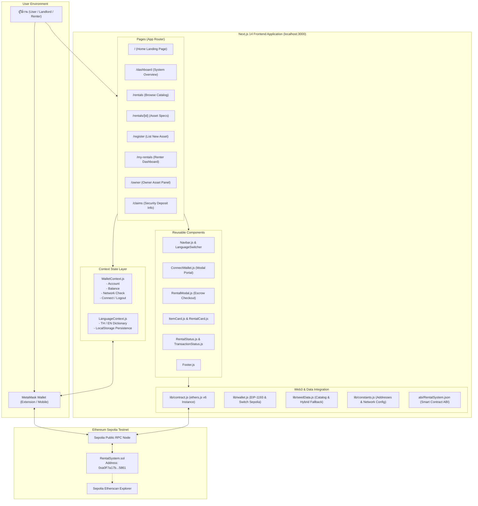

# 📦 Blockchain-Based Rental System (BlockRental)
> **ระบบจัดการการเช่าแบบกระจายศูนย์บนบล็อกเชน (Decentralized Web3 Rental Platform)**  
> พัฒนาด้วย **Next.js 14 (App Router)**, **JavaScript (ES6+)**, **ethers.js v6**, **Bootstrap 5.3**, **MetaMask** และเครือข่าย **Ethereum Sepolia Testnet**

[](https://sepolia.etherscan.io/)
[](#)
[](https://sepolia.etherscan.io/address/0xa0F7a17b2e403091F0397B3a8B9f99A8B65A5861)
[](https://nextjs.org/)
[](https://docs.ethers.org/v6/)
[](https://getbootstrap.com/)
[](#)

---

## 📑 สารบัญ (Table of Contents)
1. [ภาพรวมโครงการ (Project Overview)](#1-ภาพรวมโครงการ-project-overview)
2. [Tech Stack & Frameworks ทั้งหมดที่ใช้ (Technology Stack)](#2-tech-stack--frameworks-ทั้งหมดที่ใช้-technology-stack)
3. [สถาปัตยกรรมและองค์ประกอบของระบบ (System Architecture & Components)](#3-สถาปัตยกรรมและองค์ประกอบของระบบ-system-architecture--components)
4. [โครงสร้างไดเรกทอรีและไฟล์ (Project Directory Structure)](#4-โครงสร้างไดเรกทอรีและไฟล์-project-directory-structure)
5. [Smart Contract & รายละเอียดบนบล็อกเชน (Smart Contract Details)](#5-smart-contract--รายละเอียดบนบล็อกเชน-smart-contract-details)
6. [ขั้นตอนการสร้าง ติดตั้ง และเริ่มใช้งานระบบ (Step-by-Step Setup Guide)](#6-ขั้นตอนการสร้าง-ติดตั้ง-และเริ่มใช้งานระบบ-step-by-step-setup-guide)
7. [คู่มือการทดสอบการใช้งานหลัก (User Testing & Workflow Guide)](#7-คู่มือการทดสอบการใช้งานหลัก-user-testing--workflow-guide)
8. [มาตรฐานความปลอดภัยและความน่าเชื่อถือ (Security & Best Practices)](#8-มาตรฐานความปลอดภัยและความน่าเชื่อถือ-security--best-practices)

---

## 1. ภาพรวมโครงการ (Project Overview)

**Blockchain-Based Rental System** คือแพลตฟอร์ม Web3 DApp สำหรับการบริหารจัดการการเช่าทรัพย์สินและอุปกรณ์แบบกระจายศูนย์ (Decentralized) ออกแบบมาเพื่อแก้ไขปัญหาความขัดแย้งในระบบการเช่าแบบดั้งเดิม โดยเปลี่ยนจากการพึ่งพาตัวกลางหรือกระดาษสัญญา มาเป็นการใช้ **Smart Contract** บนเครือข่ายบล็อกเชน Ethereum Sepolia ในการควบคุมสัญญาและการชำระเงินโดยอัตโนมัติ (Trustless & Autonomous)

### 🚨 ปัญหาของระบบการเช่าแบบเดิม (Traditional Rental Flaws)
* **ความเสี่ยงในการถูกยึดหรือเบี้ยวเงินมัดจำ (Deposit Withholding Disputes)**: เจ้าของทรัพย์สินหรือแพลตฟอร์มตัวกลางมักคืนเงินมัดจำล่าช้า หรือหักเงินมัดจำโดยไม่มีหลักฐานที่ตรวจสอบได้
* **การพึ่งพาตัวกลางและค่าธรรมเนียมแฝง (Middleman Fees)**: แพลตฟอร์มตัวกลางหักส่วนแบ่งค่าคอมมิชชั่นสูง (15% - 30%)
* **ข้อมูลสัญญาแก้ไขได้และขาดความโปร่งใส (Vulnerable Records)**: ข้อมูลในฐานข้อมูลรวมศูนย์ (Centralized DB) สามารถถูกแก้ไข เปลี่ยนแปลง หรือลบได้
* **ไม่มีระบบ Escrow ล็อกเงินที่ปลอดภัย**: การโอนเงินตรงผ่านบัญชีธนาคารทำให้ผู้เช่าเสี่ยงไม่ได้รับของ หรือผู้ให้เช่าเสี่ยงไม่ได้รับเงิน

### 💡 ทางออกด้วยเทคโนโลยีบล็อกเชน (Blockchain Solutions)
* **Smart Contract Escrow**: เงินมัดจำและค่าเช่าจะถูกล็อกไว้ในสัญญาอัจฉริยะอย่างปลอดภัย และจะโอนคืนให้ผู้เช่าทันทีเมื่อมีการกดคืนของ (Return Item) สำเร็จ
* **บันทึกถาวรแก้ไขไม่ได้ (Immutable Ledger)**: ทุกรายการเช่า รหัสทรัพย์สิน เวลาเริ่มต้น-สิ้นสุด และ Transaction Hash ถูกจัดเก็บอย่างถาวรบน Sepolia Blockchain
* **การระบุตัวตนด้วย Web3 Wallet**: ล็อกอินผ่านกระเป๋าเงินดิจิทัล **MetaMask** โดยไม่ต้องกรอกรหัสผ่าน ไม่มีการจัดเก็บข้อมูลส่วนตัวในเซิร์ฟเวอร์
* **รองรับ 2 ภาษาเต็มรูปแบบ (Bilingual TH / EN)**: มีระบบสลับภาษาไทยและอังกฤษ พร้อมระบบจำค่าการตั้งค่าของผู้ใช้

---

## 2. Tech Stack & Frameworks ทั้งหมดที่ใช้ (Technology Stack)

โปรเจกต์นี้ได้รับการออกแบบตามมาตรฐาน Web3 DApp สมัยใหม่ โดยใช้เครื่องมือและไลบรารีล่าสุดดังนี้:

| หมวดหมู่ (Category) | เทคโนโลยีที่ใช้ (Technology) | เวอร์ชัน (Version) | หน้าที่และความรับผิดชอบ (Role & Description) |
|---|---|---|---|
| **Core Framework** | [Next.js](https://nextjs.org/) (App Router) | `^14.2.15` | เฟรมเวิร์กหลักของ React สำหรับทำ SSR/CSR, App Routing, Optimization และ API handling (ใช้ **JavaScript ES6+** ล้วน ไม่มี TypeScript เพื่อความเรียบง่าย) |
| **UI Library** | [React](https://react.dev/) / React DOM | `^18.3.1` | ไลบรารีจัดการ Component State, Lifecycle, Portals, Context API และ Virtual DOM |
| **Web3 Client Engine** | [ethers.js](https://docs.ethers.org/v6/) | `^6.13.4` | ไลบรารีสื่อสารกับ Ethereum Blockchain จัดการ `BrowserProvider`, `JsonRpcProvider`, `Contract`, `parseEther`, `formatEther`, การลงนามธุรกรรม และเข้ารหัส calldata |
| **Web3 Wallet Interface** | [MetaMask](https://metamask.io/) (EIP-1193) | Standard | กระเป๋าเงินคริปโตของผู้ใช้ (Injected Provider `window.ethereum`) ใช้ยืนยันตัวตน, จัดการ Key Pairs, สลับ Network และ Sign ธุรกรรม |
| **Styling & Components** | [Bootstrap](https://getbootstrap.com/) | `^5.3.3` | CSS Framework จัดการ Grid System, Responsive Layout, Badges, Modals, Cards, Tables และ Utility Classes |
| **Icon Library** | [Bootstrap Icons](https://icons.getbootstrap.com/) | `^1.11.3` | ไอคอนเวกเตอร์ SVG สำหรับการแสดงผล UI, เมนูนำทาง, หมวดหมู่ และสถานะธุรกรรม |
| **Smart Contract** | [Solidity](https://soliditylang.org/) | `^0.8.20` | ภาษาเขียน Smart Contract สำหรับคอมไพล์เป็น EVM Bytecode |
| **Security Standards** | [OpenZeppelin Contracts](https://www.openzeppelin.com/contracts) | `^5.0.0` | ไลบรารีความปลอดภัยมาตรฐาน: `Ownable` (การจัดการสิทธิ์เจ้าของระบบ) และ `ReentrancyGuard` (ป้องกันการโจมตี Reentrancy Attack) |
| **Target Blockchain** | Ethereum Sepolia Testnet | Chain ID: `11155111` | บล็อกเชนทดสอบ PoS มาตรฐานของ Ethereum สำหรับการทดสอบ Web3 DApp ด้วย Sepolia ETH ฟรี |
| **Development IDE** | [Remix IDE](https://remix.ethereum.org/) | Web-based | เครื่องมือสำหรับเขียน ทดสอบ คอมไพล์ และ Deploy สัญญาอัจฉริยะขึ้น Sepolia |
| **Runtime & Bundler** | [Node.js](https://nodejs.org/) & Webpack | Node v18+ / v20+ / v22+ | สภาพแวดล้อมรัน JavaScript ฝั่งเครื่องเซิร์ฟเวอร์และเครื่องนักพัฒนา |

---

## 3. สถาปัตยกรรมและองค์ประกอบของระบบ (System Architecture & Components)

### 🏗️ แผนภาพสถาปัตยกรรมรวม (High-Level Architecture Diagram)



---

## 4. โครงสร้างไดเรกทอรีและไฟล์ (Project Directory Structure)

```text
digital-rental/
├── abi/
│   └── RentalSystem.json         # ABI (Application Binary Interface) ของ Smart Contract
├── app/                          # Next.js 14 App Router Directory
│   ├── claims/
│   │   └── page.js               # หน้าข้อมูลระบบการเคลมและคืนเงินมัดจำ
│   ├── dashboard/
│   │   └── page.js               # หน้าแดชบอร์ดภาพรวมระบบและ Ledger ประวัติธุรกรรม
│   ├── my-rentals/
│   │   └── page.js               # หน้ารายการทรัพย์สินที่ฉันเช่า จัดการการคืนของ
│   ├── owner/
│   │   └── page.js               # แดชบอร์ดเจ้าของทรัพย์สิน ปิด/เปิด การให้เช่า
│   ├── register/
│   │   └── page.js               # หน้าลงทะเบียนทรัพย์สินใหม่ขึ้น Smart Contract
│   ├── rentals/
│   │   ├── [id]/
│   │   │   └── page.js           # หน้ารายละเอียดทรัพย์สินรายชิ้น ตารางคำนวณราคา
│   │   └── page.js               # หน้าค้นหาและกรองทรัพย์สินให้เช่าทั้งหมด
│   ├── layout.css                # สไตล์ตกแต่งเพิ่มเติมและแอนิเมชัน Web3
│   ├── layout.js                 # Root Layout ห่อหุ้ม Wallet & Language Providers
│   └── page.js                   # Landing Page หน้าแรก แนะนำระบบและคู่มือ
├── components/                   # React UI Components
│   ├── ConnectWallet.js          # ปุ่มเชื่อมต่อกระเป๋า และ Modal สถานะกระเป๋า (ใช้ React Portal)
│   ├── ErrorMessage.js           # กล่องแจ้งเตือนข้อผิดพลาดพร้อมปุ่มลองใหม่
│   ├── Footer.js                 # ส่วนท้ายของหน้าเว็บ แสดงเครดิตและลิขสิทธิ์
│   ├── ItemCard.js               # การ์ดแสดงรายการทรัพย์สินในหน้าค้นหา
│   ├── Loading.js                # แอนิเมชันกำลังโหลดข้อมูลจากบล็อกเชน
│   ├── Navbar.js                 # แถบเมนูด้านบน สลับภาษา และเชื่อมต่อ MetaMask
│   ├── RentalCard.js             # การ์ดแสดงสัญญาเช่า
│   ├── RentalModal.js            # หน้าต่าง Modal คำนวณราคาและกดยืนยันทำสัญญาเช่า
│   ├── RentalStatus.js           # ป้าย Badge แสดงสถานะสัญญา (Active, Returned, Cancelled)
│   └── TransactionStatus.js      # ป้ายแสดงสถานะธุรกรรมและลิงก์ Etherscan Tx
├── context/
│   ├── LanguageContext.js        # React Context จัดการระบบ 2 ภาษา (TH / EN)
│   └── WalletContext.js          # React Context จัดการสถานะ MetaMask, Balance, Network
├── lib/
│   ├── constants.js              # ค่าคงที่ระบบ (Chain ID, Network Name, Fallback Address)
│   ├── contract.js               # ฟังก์ชันเชื่อมต่อและเรียกใช้ Smart Contract ผ่าน ethers.js
│   ├── seedData.js               # ระบบข้อมูลแคตตาล็อกจำลองและ Dynamic Local Storage
│   ├── translations.js           # พจนานุกรมคำแปลภาษาไทยและภาษาอังกฤษ
│   └── wallet.js                 # ฟังก์ชัน Utility จัดการ EIP-1193, สลับเชน และตัดทอน Address
├── .env.local                    # การตั้งค่า Environment Variables ฝั่ง Client
├── package.json                  # รายการ Dependencies และ Scripts รันโปรเจกต์
└── README.md                     # เอกสารคู่มือฉบับสมบูรณ์
```

---

## 5. Smart Contract & รายละเอียดบนบล็อกเชน (Smart Contract Details)

### 📌 ข้อมูลการ Deploy จริงบนบล็อกเชน
* **Contract Name**: `RentalSystem`
* **Network**: Ethereum Sepolia Testnet
* **Chain ID**: `11155111` (`0xaa36a7`)
* **Contract Address**: `0xa0F7a17b2e403091F0397B3a8B9f99A8B65A5861`
* **Etherscan Link**: [https://sepolia.etherscan.io/address/0xa0F7a17b2e403091F0397B3a8B9f99A8B65A5861](https://sepolia.etherscan.io/address/0xa0F7a17b2e403091F0397B3a8B9f99A8B65A5861)
* **Compiler Version**: Solidity `^0.8.20`
* **Optimization**: Enabled (200 runs)

### 📜 ซอร์สโค้ดสัญญาอัจฉริยะฉบับสมบูรณ์ (`RentalSystem.sol`)

```solidity
// SPDX-License-Identifier: MIT
pragma solidity ^0.8.20;

import "@openzeppelin/contracts/access/Ownable.sol";
import "@openzeppelin/contracts/utils/ReentrancyGuard.sol";

contract RentalSystem is Ownable, ReentrancyGuard {
    enum RentalStatus { None, Active, Returned, Cancelled }

    struct Item {
        uint256 itemId;
        address payable owner;
        string name;
        string description;
        string category;
        uint256 rentalPrice; // ราคาเช่าต่อวัน (Wei)
        uint256 deposit;     // เงินมัดจำประกันความเสียหาย (Wei)
        bool available;      // สถานะพร้อมให้เช่า
        uint256 createdAt;   // เวลาที่ลงทะเบียน (Timestamp)
    }

    struct RentalAgreement {
        uint256 rentalId;
        uint256 itemId;
        address payable owner;
        address payable renter;
        uint256 startTime;
        uint256 endTime;
        uint256 rentalPrice;
        uint256 deposit;
        uint256 totalPaid;
        RentalStatus status;
        uint256 createdAt;
    }

    uint256 private _itemCounter;
    uint256 private _rentalCounter;

    mapping(uint256 => Item) public items;
    mapping(uint256 => RentalAgreement) public rentals;

    event ItemRegistered(uint256 indexed itemId, address indexed owner, string name, string category, uint256 rentalPrice, uint256 deposit);
    event ItemAvailabilityUpdated(uint256 indexed itemId, bool available);
    event RentalCreated(uint256 indexed rentalId, uint256 indexed itemId, address indexed renter, uint256 startTime, uint256 endTime, uint256 totalPaid, uint256 deposit);
    event ItemReturned(uint256 indexed rentalId, uint256 indexed itemId, address indexed renter, uint256 returnedTime, uint256 depositRefunded);
    event RentalCancelled(uint256 indexed rentalId, uint256 indexed itemId, address indexed renter, uint256 refundAmount);

    constructor() Ownable(msg.sender) {}

    function getItemCount() external view returns (uint256) { return _itemCounter; }
    function getRentalCount() external view returns (uint256) { return _rentalCounter; }

    // 1. ลงทะเบียนทรัพย์สินใหม่ (Owner)
    function registerItem(string calldata name, string calldata description, string calldata category, uint256 rentalPrice, uint256 deposit) external returns (uint256) {
        require(bytes(name).length > 0, "Item name cannot be empty");
        require(rentalPrice > 0, "Rental price must be greater than zero");
        _itemCounter++;
        items[_itemCounter] = Item(_itemCounter, payable(msg.sender), name, description, category, rentalPrice, deposit, true, block.timestamp);
        emit ItemRegistered(_itemCounter, msg.sender, name, category, rentalPrice, deposit);
        return _itemCounter;
    }

    // 2. ปิด/เปิด สถานะการให้เช่า (Owner)
    function updateItemAvailability(uint256 itemId, bool available) external {
        require(itemId > 0 && itemId <= _itemCounter, "Invalid item ID");
        require(items[itemId].owner == msg.sender, "Only owner can update availability");
        items[itemId].available = available;
        emit ItemAvailabilityUpdated(itemId, available);
    }

    // 3. ทำสัญญาเช่าและชำระเงิน Escrow (Renter)
    function createRental(uint256 itemId, uint256 durationInDays) external payable nonReentrant returns (uint256) {
        require(itemId > 0 && itemId <= _itemCounter, "Invalid item ID");
        require(durationInDays > 0, "Duration must be at least 1 day");
        Item storage item = items[itemId];
        require(item.available, "Item is currently not available for rent");
        require(item.owner != msg.sender, "Owner cannot rent own item");

        uint256 totalRentalFee = item.rentalPrice * durationInDays;
        uint256 totalCost = totalRentalFee + item.deposit;
        require(msg.value >= totalCost, "Insufficient payment for rental + deposit");

        _rentalCounter++;
        uint256 startTime = block.timestamp;
        uint256 endTime = block.timestamp + (durationInDays * 1 days);

        rentals[_rentalCounter] = RentalAgreement(
            _rentalCounter,
            itemId,
            item.owner,
            payable(msg.sender),
            startTime,
            endTime,
            item.rentalPrice,
            item.deposit,
            msg.value,
            RentalStatus.Active,
            block.timestamp
        );

        item.available = false;

        // โอนค่าเช่าให้เจ้าของทรัพย์สินทันที
        (bool feeTransferSuccess, ) = item.owner.call{value: totalRentalFee}("");
        require(feeTransferSuccess, "Rental fee transfer to owner failed");

        // เงินมัดจำ (item.deposit) จะคงอยู่ใน Contract Escrow จนกว่าจะมีการกดคืนของ
        emit RentalCreated(_rentalCounter, itemId, msg.sender, startTime, endTime, msg.value, item.deposit);
        return _rentalCounter;
    }

    // 4. คืนทรัพย์สินและรับเงินมัดจำคืนอัตโนมัติ (Renter)
    function returnItem(uint256 rentalId) external nonReentrant {
        require(rentalId > 0 && rentalId <= _rentalCounter, "Invalid rental ID");
        RentalAgreement storage agreement = rentals[rentalId];
        require(agreement.renter == msg.sender, "Only renter can trigger return");
        require(agreement.status == RentalStatus.Active, "Rental agreement is not active");

        agreement.status = RentalStatus.Returned;
        items[agreement.itemId].available = true;

        // คืนเงินมัดจำให้ผู้เช่าอัตโนมัติจาก Escrow
        uint256 depositRefund = agreement.deposit;
        if (depositRefund > 0) {
            (bool refundSuccess, ) = agreement.renter.call{value: depositRefund}("");
            require(refundSuccess, "Deposit refund failed");
        }

        emit ItemReturned(rentalId, agreement.itemId, msg.sender, block.timestamp, depositRefund);
    }

    // 5. ยกเลิกสัญญาเช่า (กรณีข้อพิพาทหรือยกเลิก)
    function cancelRental(uint256 rentalId) external nonReentrant {
        require(rentalId > 0 && rentalId <= _rentalCounter, "Invalid rental ID");
        RentalAgreement storage agreement = rentals[rentalId];
        require(agreement.renter == msg.sender || agreement.owner == msg.sender, "Not authorized to cancel");
        require(agreement.status == RentalStatus.Active, "Rental agreement is not active");

        agreement.status = RentalStatus.Cancelled;
        items[agreement.itemId].available = true;

        uint256 refundAmount = agreement.deposit;
        if (refundAmount > 0) {
            (bool refundSuccess, ) = agreement.renter.call{value: refundAmount}("");
            require(refundSuccess, "Refund failed");
        }

        emit RentalCancelled(rentalId, agreement.itemId, agreement.renter, refundAmount);
    }

    // 6. ฟังก์ชันอ่านข้อมูลทั้งหมดแบบ Batch (View)
    function getAllItems() external view returns (Item[] memory) {
        Item[] memory allItems = new Item[](_itemCounter);
        for (uint256 i = 1; i <= _itemCounter; i++) {
            allItems[i - 1] = items[i];
        }
        return allItems;
    }

    function getAllRentals() external view returns (RentalAgreement[] memory) {
        RentalAgreement[] memory allRentals = new RentalAgreement[](_rentalCounter);
        for (uint256 i = 1; i <= _rentalCounter; i++) {
            allRentals[i - 1] = rentals[i];
        }
        return allRentals;
    }
}
```

---

## 6. ขั้นตอนการสร้าง ติดตั้ง และเริ่มใช้งานระบบ (Step-by-Step Setup Guide)

### 📌 สิ่งที่ต้องมีก่อนเริ่ม (Prerequisites)
1. **Node.js**: เวอร์ชัน 18.x ขึ้นไป (แนะนำ Node 20 หรือ 22)
2. **Git**: สำหรับการ Clone หรือจัดการซอร์สโค้ด
3. **MetaMask Extension**: ติดตั้งบนเบราว์เซอร์ (Chrome, Brave, Edge, Firefox)
4. **เหรียญ Sepolia ETH**: ขอรับได้ฟรีผ่าน Google Sepolia Faucet หรือ Alchemy Faucet เพื่อใช้จ่ายค่า Gas

---

### ขั้นตอนที่ 1: ติดตั้ง Dependencies
เปิด Terminal (Command Prompt หรือ PowerShell) แล้วเข้าไปที่โฟลเดอร์โปรเจกต์:
```bash
# 1. เข้าสู่ไดเรกทอรีโปรเจกต์
cd d:\BlockChain\Project\digital-rental

# 2. ติดตั้งแพ็กเกจไลบรารี
npm install
```

---

### ขั้นตอนที่ 2: ตั้งค่า Environment Variables (`.env.local`)
ตรวจสอบหรือสร้างไฟล์ `.env.local` ภายในโฟลเดอร์ `digital-rental/` ดังนี้:

```env
# ที่อยู่ Smart Contract ที่ Deploy บน Sepolia
NEXT_PUBLIC_CONTRACT_ADDRESS=0xa0F7a17b2e403091F0397B3a8B9f99A8B65A5861

# รหัสเครือข่าย Ethereum Sepolia Testnet
NEXT_PUBLIC_CHAIN_ID=11155111
NEXT_PUBLIC_NETWORK_NAME=Sepolia

# Block Explorer & RPC Gateway
NEXT_PUBLIC_EXPLORER_URL=https://sepolia.etherscan.io
NEXT_PUBLIC_RPC_URL=https://rpc.sepolia.org
```

---

### ขั้นตอนที่ 3: เริ่มต้น Local Development Server
รันคำสั่งเพื่อสตาร์ต Next.js Dev Server:
```bash
npm run dev
```
เมื่อหน้าจอขึ้นข้อความ:
```text
▲ Next.js 14.2.15
- Local: http://localhost:3000
✓ Ready in 4.5s
```
ให้เปิดเบราว์เซอร์ไปที่: 👉 **[http://localhost:3000](http://localhost:3000)**

---

### ขั้นตอนที่ 4: เชื่อมต่อ MetaMask และเข้าสู่ Sepolia Testnet
1. คลิกปุ่ม **"เชื่อมต่อกระเป๋า" (Connect Wallet)** ที่มุมขวาบนของหน้าเว็บ
2. หน้าต่าง MetaMask จะเด้งขึ้นมา ให้เลือกบัญชีกระเป๋าแล้วกด **"Next"** และ **"Connect"**
3. หากกระเป๋าของคุณไม่ได้อยู่บนเครือข่าย Sepolia ระบบจะขึ้นปุ่มเตือน **"เปลี่ยนไปใช้เครือข่าย Sepolia" (Switch to Sepolia)** โดยอัตโนมัติ

---

## 7. คู่มือการทดสอบการใช้งานหลัก (User Testing & Workflow Guide)

### 🧪 1. การเช่าทรัพย์สิน (Rent Asset Workflow)
1. ไปที่เมนู **"ค้นหาของเช่า" (`/rentals`)**
2. เลือกทรัพย์สินที่สนใจ (เช่น **Item #7: Taylor 214ce Guitar** หรือ **Item #4: Segway Scooter**)
3. คลิกปุ่ม **"เช่าทันที"**
4. ในหน้าต่าง Modal ให้ระบุจำนวนวันที่ต้องการเช่า (ระบบจะคำนวณค่าเช่ารวมเงินมัดจำ Escrow ให้แบบเรียลไทม์)
5. คลิกปุ่ม **"ยืนยันและชำระเงิน"**
6. **MetaMask** จะเด้งขึ้นมาให้คุณตรวจสอบและกดยืนยัน (Confirm)
7. เมื่อธุรกรรมได้รับการยืนยันบนบล็อกเชน ระบบจะแสดง **Transaction Hash** พร้อมเปลี่ยนสถานะเป็น **"ทำสัญญาเช่าสำเร็จ"**

### 📦 2. การตรวจสอบประวัติและคืนของเพื่อรับมัดจำคืน (Return Item & Deposit Refund)
1. ไปที่เมนู **"รายการที่ฉันเช่า" (`/my-rentals`)**
2. คุณจะพบรายการทรัพย์สินที่คุณเพิ่งทำสัญญาเช่าแสดงสถานะ **Active (กำลังเช่า)**
3. เมื่อต้องการคืนของ ให้คลิกปุ่ม **"คืนทรัพย์สิน" (Return Item)**
4. กดยืนยันธุรกรรมใน MetaMask
5. Smart Contract จะทำการปลดล็อกเงินมัดจำ (Deposit Refund) และโอนคืนเข้ากระเป๋าของคุณทันที พร้อมอัปเดตสถานะเป็น **Returned (คืนแล้ว)**

### ➕ 3. การลงทะเบียนทรัพย์สินใหม่ขึ้น Smart Contract (Register Asset Workflow)
1. ไปที่เมนู **"ลงทะเบียนทรัพย์สิน" (`/register`)**
2. กรอกรายละเอียด:
   * **ชื่อทรัพย์สิน**: เช่น `DJI Pocket 3 Creator Combo`
   * **หมวดหมู่**: กล้องและอุปกรณ์มีเดีย
   * **รายละเอียด**: บันทึกวิดีโอ 4K 120fps เซ็นเซอร์ 1 นิ้ว
   * **ราคาเช่าต่อวัน**: `0.01` ETH
   * **เงินมัดจำประกัน**: `0.02` ETH
3. คลิกปุ่ม **"ลงทะเบียนทรัพย์สินบนบล็อกเชน"**
4. กดยืนยันใน MetaMask ➔ ข้อมูลจะถูกเขียนลงใน Smart Contract บน Sepolia ทันที และจะไปปรากฏในหน้า **"ค้นหาของเช่า"** และ **"จัดการของให้เช่า" (`/owner`)**

---

## 8. มาตรฐานความปลอดภัยและความน่าเชื่อถือ (Security & Best Practices)

* **OpenZeppelin ReentrancyGuard**: ป้องกันการโจมตีประเภท Reentrancy ในฟังก์ชันที่มีการโอนเหรียญ ETH (`createRental`, `returnItem`, `cancelRental`) ด้วย Modifier `nonReentrant`
* **Checks-Effects-Interactions Pattern**: ทุกฟังก์ชันจะทำการตรวจสอบเงื่อนไข (`require`) และอัปเดตสถานะภายในสัญญาก่อนที่จะทำธุรกรรมภายนอก
* **EIP-1193 & Account Change Listener**: มีระบบตรวจจับเมื่อผู้ใช้สลับบัญชีใน MetaMask (`accountsChanged`) หรือสลับ Network (`chainChanged`) และอัปเดตหน้าเว็บใหม่อัตโนมัติ
* **React Portal Stacking Context Fix**: ตัว Modal ทำงานผ่าน `createPortal(..., document.body)` ป้องกันการถูกกลืนหรือทับด้วย CSS Backdrop Filter ของ Navbar
* **Smart Hybrid Architecture**: ผสานการทำงานระหว่างสัญญาบนบล็อกเชนจริงเข้ากับชุดข้อมูลจำลอง (Pre-seeded Catalog) ทำให้ระบบมีความสมบูรณ์ สวยงาม พร้อมสำหรับการนำเสนอผลงานและประเมินผลโครงการวิชาการ

---

### 👨‍💻 พัฒนาและดูแลโดย
* **Project**: Blockchain-Based Rental System (BlockRental)
* **Academic Capstone Project**: Decentralized Application (Web3 DApp)
* **Blockchain**: Ethereum Sepolia Testnet
* **Smart Contract Address**: [`0xa0F7a17b2e403091F0397B3a8B9f99A8B65A5861`](https://sepolia.etherscan.io/address/0xa0F7a17b2e403091F0397B3a8B9f99A8B65A5861)
